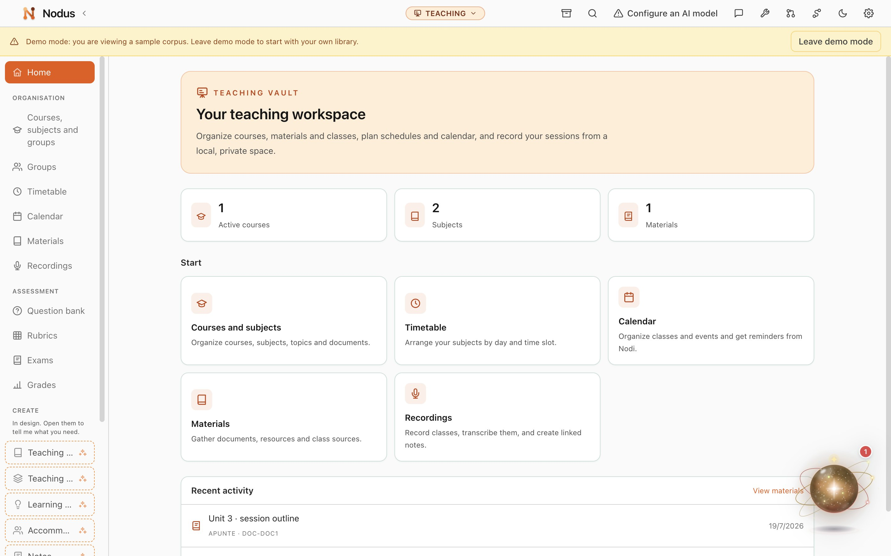
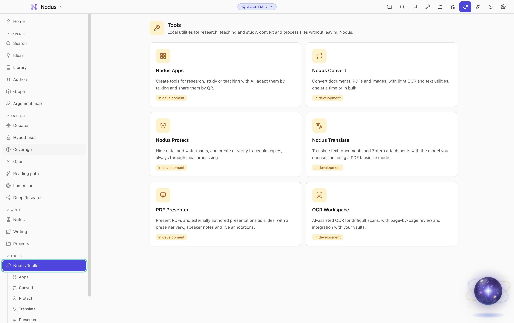
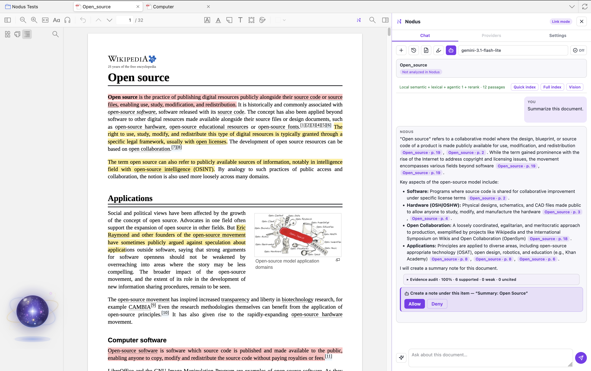

  

<h1 align="center">Nodus</h1>

<strong>One place for research, teaching and study</strong>

  <a href="https://github.com/Drakonis96/nodus/releases/latest">Download Nodus</a> ·
  <a href="https://drakonis96.github.io/nodus/">Visit the website</a> ·
  <a href="https://drakonis96.github.io/nodus/demo/">Try the interactive tour</a>

Nodus is a desktop centre for university work. It brings sources, notes, data, ideas and learning materials together without forcing every project into the same shape.

Each vault is a focused workspace. Researchers can build a connected corpus, historians can document a family tree, teams can explore structured data, teachers can plan and assess their courses, and students can organise an entire degree. You can move between them from one calm, consistent app.

Nodus is local first. Your vaults and search indexes live on your computer. You decide when a feature may use an online AI provider, and you can also work with compatible local models.

## Install Nodus

Download the installer for your computer and open it. There is no server to configure and no account is required to begin.

| Platform | Latest installer |
| --- | --- |
| macOS with Apple silicon | [Download DMG](https://github.com/Drakonis96/nodus/releases/latest/download/Nodus-mac-arm64.dmg) |
| Windows 10 and 11 | [Download EXE](https://github.com/Drakonis96/nodus/releases/latest/download/Nodus-win-x64.exe) |
| Ubuntu and Debian | [Download DEB](https://github.com/Drakonis96/nodus/releases/latest/download/Nodus-linux-amd64.deb) |
| Other Linux distributions | [Download AppImage](https://github.com/Drakonis96/nodus/releases/latest/download/Nodus-linux-x86_64.AppImage) |

The standalone Zotero plugin is available from the same release as [nodus-zotero.xpi](https://github.com/Drakonis96/nodus/releases/latest/download/nodus-zotero.xpi). In Zotero, open **Tools → Add-ons**, choose **Install Add-on From File**, and select the downloaded file.

The plugin indexes the complete text of selected PDF, EPUB and HTML attachments, combines semantic and lexical retrieval across documents, and attaches exact passage/page citations to its answers. Multilingual semantic search runs locally through a quantised E5 model—no embedding API key or per-query embedding cost is required—and the compressed text index plus vectors remain in the Zotero profile. Long PDFs are reconstructed by page, column and paragraph, with repeated margins removed and source coordinates retained. A bounded two-round retriever can reformulate searches and inspect specific page ranges before answering. Its evidence audit flags uncited or weakly supported claims. For PDFs, **Vision** reads the rendered page—including scanned text, figures, tables, formulas and diagrams—and merges the extraction into the searchable index; **Index** applies the same OCR fallback to text-poor pages.

The [latest release page](https://github.com/Drakonis96/nodus/releases/latest) always contains the newest available installers and release notes.

## Share a vault with Nodus Server

Nodus Server is an optional, self-hosted companion for courses and research groups. A vault owner can explicitly publish a filtered read-only copy, give each student or researcher access to selected spaces, and connect those spaces to ChatGPT or Claude through OAuth-protected remote MCP. The desktop app sends only outbound HTTPS traffic and keeps this publisher completely separate from its localhost MCP server.

The server runs with Docker on Windows, macOS or Linux and supports the bundled Caddy HTTPS proxy as well as an existing Caddy, Nginx or Traefik installation. Setup and user management happen in a web page; starting the containers is the only terminal step. See the [Nodus Server installation guide](server/README.md).

## One app, five working vaults

### Academic vault

Build a research corpus from Zotero and turn reading into connected knowledge. Nodus can surface themes, ideas, agreements, contradictions and unanswered questions while keeping every claim close to its source.

Its strongest tools include semantic search, an idea graph, author profiles, coverage and gap analysis, reading paths, argument maps, Deep Research and a writing workshop with verifiable citations. A Word companion is available for bringing Nodus context into a manuscript.

### Genealogy vault

Document people, relationships and evidence in a research-led family archive. The tree, timeline, map and records library stay connected so that a family story never loses its documentary basis.

You can import and export GEDCOM, attach records to people and events, review suggested relationships before accepting them and investigate a lineage with dedicated research tools.

### Databases vault

Create approachable databases for projects that do not fit a spreadsheet. Tables support typed fields, relations, formulas, rollups, filters and reusable views.

CSV import makes it easy to begin with existing material. Analysis, chat and AI-assisted columns help you classify records, find patterns and answer questions across the dataset.

### Study vault

Organise subjects, reading, class notes, recordings and deadlines in one place. Materials can include documents, PDFs, EPUB books and audio, with tools for transcription and focused reading.

Nodus turns those materials into study support grounded in your own course content. It includes course planning, connected ideas, a subject graph, question banks, practice tests, exams, flashcards and spaced review.

### Teaching vault

Plan academic years, courses, subjects and teaching groups in a workspace built for educators. Timetables, calendars, materials and recordings remain connected to the classes they support.

Teaching tools cover private student rosters, gradebooks, reusable rubrics and exam building. AI can generate teaching materials, questions and rubric structures, but Nodus does not send rosters, grades or student answers to a model and does not use AI to grade, profile or evaluate students.

## Nodus Toolkit

The Toolkit provides cross-vault document utilities. **Nodus Convert** converts and processes documents, PDFs, images and text. **Nodus Protect** combines PDFs and images, permanently redacts or blurs sensitive areas, adds watermarks and a legal footer, creates fully rasterised PNG/PDF/ZIP results and can issue or verify IDPS v1 traceable copies. **Nodus Translate** translates pasted text, files and Zotero attachments with a chosen AI model; it preserves DOCX/EPUB structure and includes a rasterised PDF facsimile mode that retains page geometry, backgrounds and images while replacing visible text. PDF Presenter and OCR Workspace are also available.

Protect can read files selected from disk or compatible sources in the active vault and can save each result back to disk, share it through the operating system or store it in the vault’s Protected Copies library. Its document processing is entirely local: it does not send protected documents to AI providers or any external service. This statement applies specifically to Nodus Protect; other optional Nodus features can use network providers when the user configures and invokes them.

## Zotero plugin

The standalone Zotero plugin brings Nodus search into your reference manager. It indexes the complete text of selected PDF, EPUB and HTML attachments, combines semantic and lexical retrieval across documents, and attaches exact passage and page citations to its answers. Multilingual semantic search runs locally through a quantised E5 model—no embedding API key or per-query embedding cost is required—and the compressed text index plus vectors remain in the Zotero profile. Long PDFs are reconstructed by page, column and paragraph, with repeated margins removed and source coordinates retained. A bounded two-round retriever can reformulate searches and inspect specific page ranges before answering. Its evidence audit flags uncited or weakly supported claims. For PDFs, Vision reads the rendered page—including scanned text, figures, tables, formulas and diagrams—and merges the extraction into the searchable index; Index applies the same OCR fallback to text-poor pages.

## Meet Nodi

Nodi is the friendly guide that lives inside Nodus. It helps new users understand a vault, points out useful next steps and keeps notifications easy to follow without taking over the workspace.

  

## Made for serious academic work

- Separate vaults keep unrelated projects and roles from becoming one large, confusing library
- Local storage and encrypted backups help institutions retain control of their work
- Demo modes let anyone explore realistic workspaces before importing personal material
- Spanish, English, French, German, European Portuguese, Brazilian Portuguese and Italian interfaces support international teams and classrooms
- Light and dark themes make long reading and writing sessions more comfortable

Nodus is useful for individual work today and is designed with universities, research groups, teaching teams and learning communities in mind.

## Cite Nodus

If Nodus contributes substantially to research that leads to a publication, please cite the version you used. The repository provides machine-readable citation metadata in [`CITATION.cff`](CITATION.cff), which GitHub can render in APA and BibTeX formats.

## Roadmap

Nodus is growing through new vaults rather than adding every possible tool to one menu.

| Vault | What it will bring |
| --- | --- |
| Primary sources | Archival description, source criticism and evidence-led work with historical material |
| Testimonies | Interviews, transcription, coding and oral history workflows |
| Worldbuilding | Characters, places, rules and narratives for research-based creative projects |

Worldbuilding can already be opened as a preview. Primary Sources and Testimonies are planned next. Preview vaults are clearly marked in the app and are not presented as finished features.

## Explore before importing anything

Every working vault includes a demo mode with sample content. It is the quickest way to understand how Nodus feels and what each workspace can do.

You can also visit the [interactive browser tour](https://drakonis96.github.io/nodus/demo/) without installing the app.

## Open and evolving

Nodus is released under the [MIT License](LICENSE). Its [privacy policy](PRIVACY.md), [third-party notices](THIRD_PARTY_NOTICES.md) and [deployment checklist](legal/RGPD_DEPLOYMENT_CHECKLIST.md) document the privacy and licensing boundaries of each installation. Ideas, bug reports and academic use cases are welcome through [GitHub Issues](https://github.com/Drakonis96/nodus/issues).
