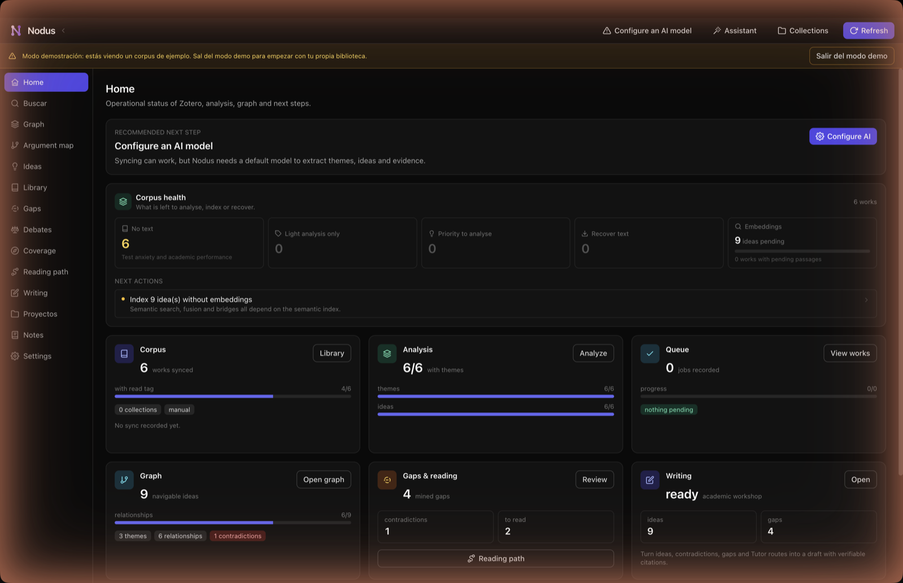
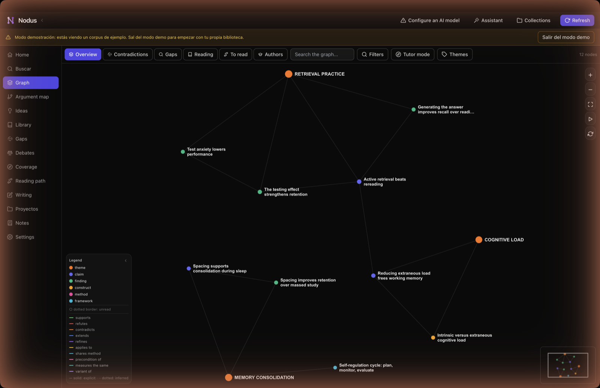
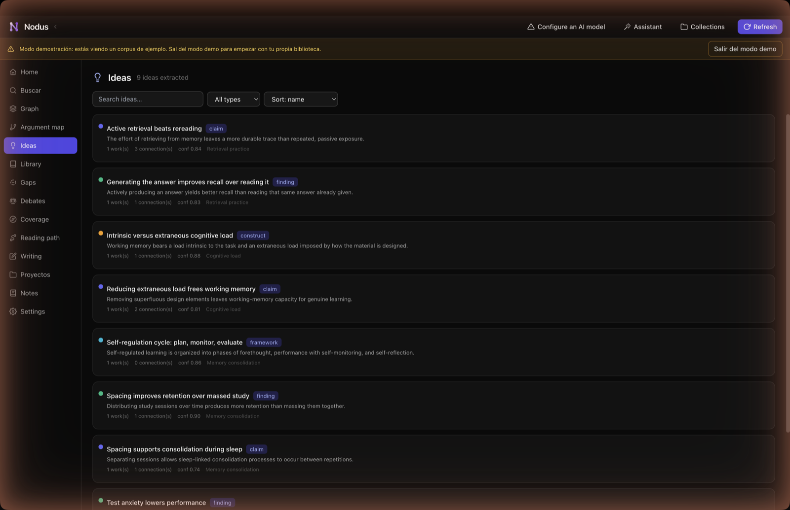
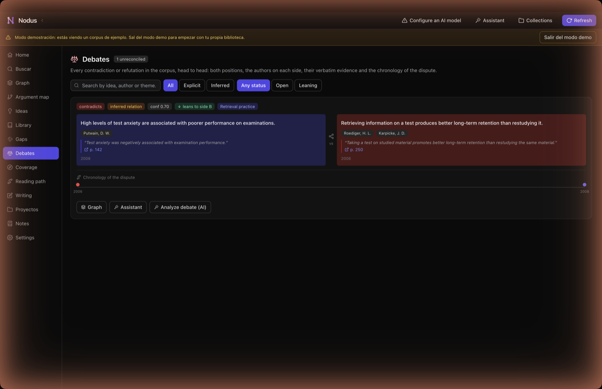
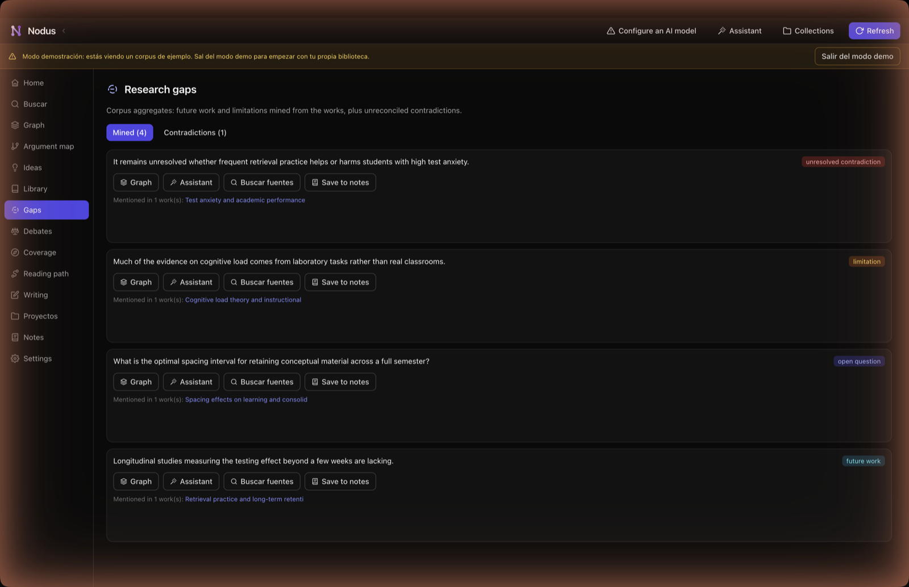
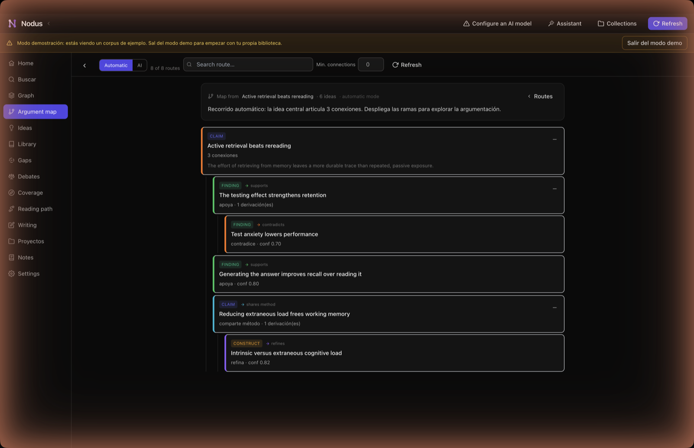
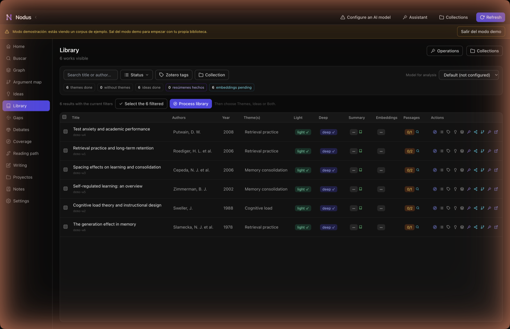
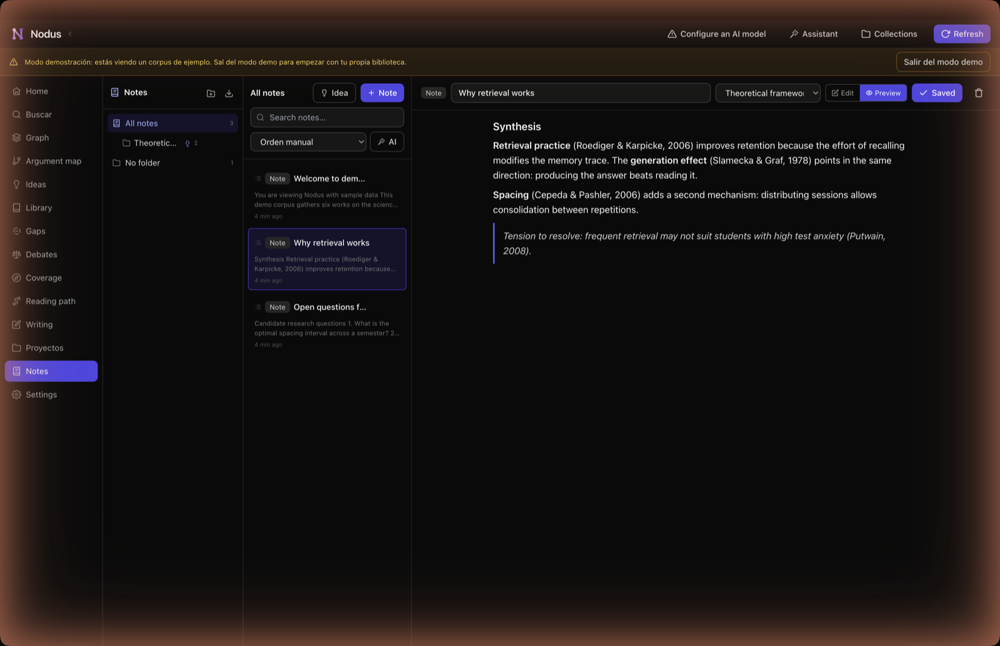
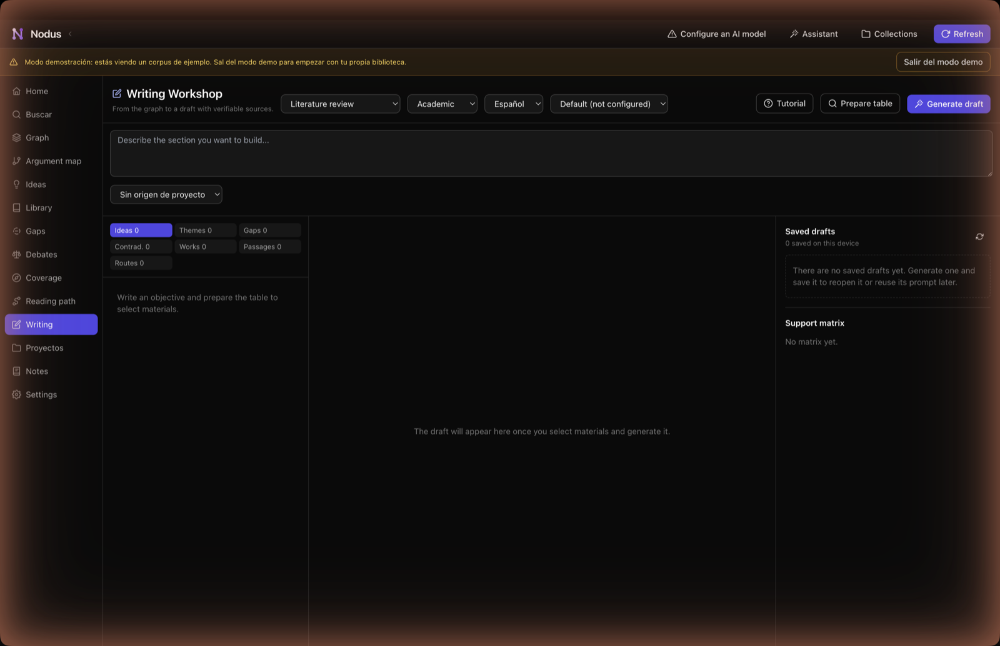

# Nodus

Desktop app that turns a local Zotero library into a navigable idea graph.
Extracts typed claims, evidence and relations from your readings, then lets you
browse contradictions, detect research gaps, map coverage of a thesis question,
and generate structured academic drafts — all grounded in verbatim citations from
your sources.

Everything runs locally. The only external calls are to the AI provider you
configure. Your data, API keys and embeddings stay on your machine.

> **New in v0.7.x** — the writing copilot is now available over MCP: select a
> passage and get its typed relations (supports / contradicts / refines …) with
> the Zotero item to cite. The demo corpus is bilingual (English / Spanish) and
> follows the app language. Plus demo mode (explore with sample data, no Zotero
> or API key needed), expanded tutorial coverage, and global search.

---

## Screenshots

A tour of the main sections, shown with the built-in demo corpus (a small
science-of-learning sample — no real library required).

<table>
  <tr>
    <td width="33%"><a href="docs/screenshots/01-home.png"></a><br/><sub><b>Home</b> — corpus status, analysis and next steps</sub></td>
    <td width="33%"><a href="docs/screenshots/02-graph.png"></a><br/><sub><b>Idea graph</b> — typed relations between claims, findings and themes</sub></td>
    <td width="33%"><a href="docs/screenshots/03-ideas.png"></a><br/><sub><b>Ideas</b> — extracted claims and findings with evidence and confidence</sub></td>
  </tr>
  <tr>
    <td width="33%"><a href="docs/screenshots/04-debates.png"></a><br/><sub><b>Debates</b> — contradictions head to head, with verbatim evidence</sub></td>
    <td width="33%"><a href="docs/screenshots/05-gaps.png"></a><br/><sub><b>Research gaps</b> — future work, limitations and open questions</sub></td>
    <td width="33%"><a href="docs/screenshots/09-argument-map.png"></a><br/><sub><b>Argument map</b> — the logical structure around an idea</sub></td>
  </tr>
  <tr>
    <td width="33%"><a href="docs/screenshots/07-library.png"></a><br/><sub><b>Library</b> — your Zotero works with scan and analysis status</sub></td>
    <td width="33%"><a href="docs/screenshots/06-notes.png"></a><br/><sub><b>Notes</b> — Markdown workspace with clickable nodus:// citations</sub></td>
    <td width="33%"><a href="docs/screenshots/08-writing.png"></a><br/><sub><b>Writing workshop</b> — outline and draft from selected graph nodes</sub></td>
  </tr>
</table>

---

## What it does

| Phase | What Nodus provides |
|-------|---------------------|
| **Read** | Two-level scanning: light (title + abstract, cheap) and deep (full text, ideas + evidence + relations). Automatic or manual, your choice. |
| **Understand** | Idea graph (Cytoscape.js), author graph, debate view (contradictions as two-sided face-offs), Tutor mode (AI-guided step-by-step walkthrough). |
| **Orient** | Research gap mining, reading path planner, research coverage map (decompose a thesis question, map which sub-questions your corpus covers). |
| **Write** | Writing workshop (outline + draft + support matrix + bibliography from selected graph nodes), notes workspace with folders, Markdown editor, and clickable `nodus://` citations. |
| **Converse** | Research assistant chat grounded in your corpus (ideas, passages, contradictions, gaps, author graph — you pick the context). |

### Demo mode

On a fresh install with an empty database, Nodus offers to load a curated
sample corpus: six works on the science of learning, nine ideas, six relations,
four research gaps, and notes. The sample text follows the interface language
(English or Spanish). You can explore every static view without Zotero or an API
key. Exit demo mode from the banner or Settings > Data to clear the sample and
start with your own library.

---

## Stack

| Layer | Technology |
|-------|------------|
| Shell | Electron + electron-builder (DMG / NSIS), `contextIsolation: true`, `nodeIntegration: false` |
| Renderer | React 18 + TypeScript + Vite |
| UI | Tailwind CSS, Framer Motion (respects `prefers-reduced-motion`) |
| Graph | Cytoscape.js |
| Database | SQLite via `better-sqlite3` (main process, transactional, versioned migrations) |
| Embeddings | Per-idea Float32 vectors; in-memory cosine similarity for fusion (sqlite-vec ready) |
| AI | Anthropic, OpenAI, OpenRouter, DeepSeek, Gemini clients in main process; keys stored with Electron `safeStorage` |
| Text extraction | `pdfjs-dist` (text), `mammoth` (docx), Tesseract OCR (opt-in, local) |

## Architecture

```
electron/                Main process (Node)
  db/                    better-sqlite3, migrations, repository pattern
  zotero/                Read-only Zotero 7 local API client (pagination + diff)
  ai/                    Providers, prompts, light/deep scan, fusion, tutor,
                         debate, research map, writing workshop, embedding pipeline
  extraction/            PDF/MD/docx text extraction + chunking + Unpaywall fallback
  pipeline/              Priority queue, retries with backoff, resume-after-restart
  sync/                  Full + realtime incremental sync with Zotero
  graph/                 Idea graph, author graph, contradictions, reading path
  export/                .nodus encrypted backup, notes export, research coverage export
  secrets/               safeStorage-backed API key encryption (never crosses IPC)
  mcp/                   Local Model Context Protocol server for external AI clients
  ipc.ts, preload.ts, main.ts
shared/types.ts          Domain types + typed window.nodus IPC contract
src/                     React renderer (views, components, i18n)
```

The renderer never touches Node, the filesystem, or the network. Every
sensitive operation goes through the typed `window.nodus` bridge exposed by the
preload script.

---

## Prerequisites

- **Zotero 7+** running with the local API enabled (`http://localhost:23119/api/`).
  Nodus is read-only and never writes to Zotero.
- An **AI API key** for at least one provider (Anthropic, OpenAI, OpenRouter,
  DeepSeek, or Gemini). Embeddings currently require OpenAI, OpenRouter, or
  Gemini; with Anthropic only, fusion falls back to a conservative "new idea"
  policy.
- Node.js 20+.

Or skip all of the above: launch the app, click **Cargar demo**, and explore.

## Setup

```bash
npm install
npm run dev      # Vite + Electron in development
```

## Build

```bash
npm run dist:mac   # .dmg + .zip (arm64)
npm run dist:win   # NSIS installer
npm run dist       # current platform
```

---

## Features

### Two-level scanning

**Light scan** — title + abstract only, for every monitored work. Assigns
coarse-grained parent themes. Cheap, incremental, and what keeps unread works
visible on the map so gaps stay visible.

**Deep scan** — full clean text. Triggered per-work by a configurable read tag
(default: `leído`) or by manual selection. Extracts typed ideas (claim, finding,
construct, method, framework), verbatim evidence anchored to exact passages,
then fuses each idea against the global graph. The author layer is derived
post-process — the model is never asked to infer global author relations.

### Idea graph

Interactive Cytoscape.js graph with multiple lenses (ideas, authors), presets
(contradictions, gaps, reading focus, unread works), theme-based filtering,
search, and history playback. Every node opens a detail sidebar with occurrences,
evidence and relations.

### Tutor mode

AI-guided, step-by-step walkthrough of your idea graph. A long-context model
analyses all ideas, themes and connections and proposes weighted routes:

- **Recorrido completo** — full coverage, ordered by weight.
- **Desde un objetivo** — routes traced from a specific research interest.

No artificial stop cap. Narration streams as one continuous discourse grounded
in the node's evidence. The graph spotlights and frames each stop live.

### Debates

Contradiction and refutation edges rendered as two-sided face-offs with authors,
evidence, and a chronology. Optional AI synthesis (streamed) to understand the
tension and decide how your work fits.

### Research coverage map

Write a thesis question; Nodus decomposes it into sub-questions and maps each
against your corpus: covered, partially covered, uncovered, or internally
disputed. Tracks corpus growth and flags stale mappings. Exports to Markdown.

### Reading path

Describe your research priorities; Nodus orders what to read and in what phase,
justifying each choice with gap, foundational, recency, and connectivity scores.

### Writing workshop

Choose the target form (literature review, theoretical framework, debate
synthesis, gap justification, chapter section, research question), describe the
objective, select from the suggested materials (ideas, themes, gaps,
contradictions, works, passages, saved Tutor routes), and generate a structured
result: outline, Markdown draft, support matrix, bibliography, next steps and
limitations. All citations use `nodus://` links that resolve to the real
source/evidence inside Nodus. Exports to Markdown. Drafts can be saved locally
and re-opened.

### Notes workspace

Folders and subfolders with a Markdown editor. Capture content from the research
assistant, writing workshop, debate view, and individual ideas with one click.
`nodus://` citations stay clickable inside the editor. Manual ideas created from
notes are integrated into the graph. Supports export (structured Markdown or
JSON), AI-assisted reordering, and folder-level idea suggestions.

### Argument map

Trace the logical structure around any idea. Two modes: **AI** (model-driven
hierarchical outline) or **auto** (structural, using real graph edges — no
model needed). Surfaces debate hubs and connectivity-ranked seed candidates.

### Global search

Keyword search across ideas, works, gaps, themes, authors and notes. Results
link directly to the relevant detail in each view.

### Research assistant

Conversational AI grounded in your corpus. Pick the context: ideas, themes,
contradictions, gaps, reading path, authors, documents, passages, and the full
graph. Answers render as Markdown with `nodus://` citations. Streamed with
optional reasoning trace. Conversation history is persisted.

### Sync

Manual (button) or realtime (polls the Zotero library version every ~25s and
diffs with `?since=`). Each sync writes a log entry.

### Large-PDF handling

Deep-scan text resolution escalates only as far as needed:

1. **Zotero indexed full text** — reuse if substantial (≥90% of pages).
2. **PDF analyzer** — samples pages, classifies as digital / hybrid / scanned.
3. **Streaming extraction** — page-by-page, `[[p. N]]` markers for model grounding.
4. **OCR** (opt-in) — only image pages of scanned/hybrid PDFs, locally via Tesseract.
5. **Fallbacks** — Unpaywall (by DOI) → abstract-only → none.

All phases report live progress through the queue bar.

### MCP server

Optional local Model Context Protocol server (Streamable HTTP) for external AI
clients (Claude Desktop, ChatGPT, generic MCP clients). Bearer-token auth,
localhost only. It exposes the derived graph **read-only** (ideas, debates,
gaps, authors, coverage) plus write access to your own notes, folders and saved
drafts.

The **writing copilot** is part of this surface, mirroring the Word add-in so any
MCP client can situate a draft passage in your corpus:

- `nodus_analyze_passage` — takes an arbitrary passage and returns its typed
  relations with the whole corpus (supports, contradicts, refines, extends …),
  each with similarity, confidence, a rationale and the Zotero item to cite.
- `nodus_get_copilot_idea` — one idea shaped for writing: statement, evidence,
  connections and the ready-to-cite Zotero bridge (key + author-year).
- `nodus_compose_insertion` — drafts a short, academic sentence that integrates
  a chosen idea into your paragraph with the parenthetical citation in place.

### Export / import

Settings > Data > Export produces a self-contained `*.nodus` archive encrypted
with a generated password: transactionally consistent SQLite snapshot, selected
model settings, API keys, embeddings, chat history, extracted text, summaries
and passages. Import restores the complete state without rescanning.

---

## Data schema

See `electron/db/migrations.ts` for the authoritative schema. Core tables:

- `works` — central registry; stable `nodus_id` (UUID), tracks `light_status` / `deep_status`, hashes.
- `themes` / `work_themes` — light-scan theme clusters.
- `ideas` — canonical idea nodes with embeddings.
- `idea_occurrences` — how each work develops an idea.
- `evidence` — anchored quotes with location and kind (explicit / paraphrased).
- `edges` — typed, directed relations (solid = explicit, dashed = inferred).
- `authors` / `author_relations` / `work_authors` — derived author layer.
- `gaps` — future work, limitation, open question, unresolved contradiction.
- `notes` / `note_folders` — user-structured workspace.
- `research_questions` / `rq_sub_questions` — thesis decomposition + coverage map.
- `chat_conversations` / `chat_messages` — research assistant history.

## Security

- API keys are encrypted with Electron `safeStorage` and stored in `userData`
  (outside the repo). They never cross the IPC boundary; the renderer only sees
  a boolean `providerKeys` map.
- The `.gitignore` excludes `*.sqlite`, `*.nodus`, `.env`, and key material.
- Backups strip `providerKeys` from settings; the encrypted archive carries the
  keys separately.
- The MCP server binds to localhost only and requires a bearer token.

## The three core prompts

The verbatim system prompts live in `electron/ai/prompts.ts`:

- **Prompt 0** — light scan (themes).
- **Prompt 1** — deep extraction (ideas, evidence, relations, gaps, authors).
- **Prompt 2** — fusion / idea resolution against the global graph.

All free-text fields are produced in the configured prompt language (Spanish or
English); `quote` fields stay verbatim in the source language. JSON output is
validated and retried at `temperature 0` on parse failure.

## License

MIT
