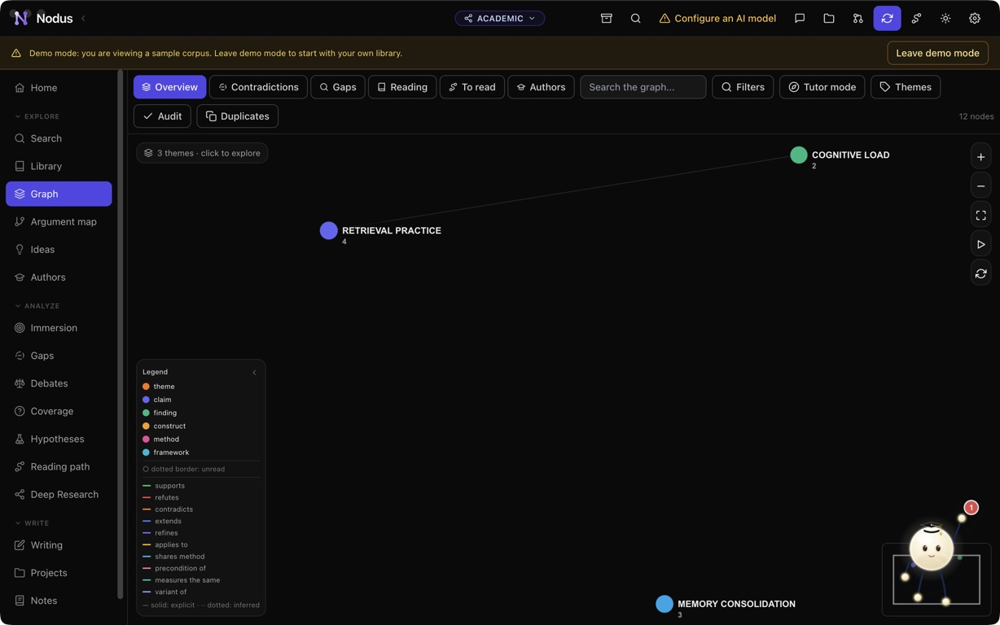
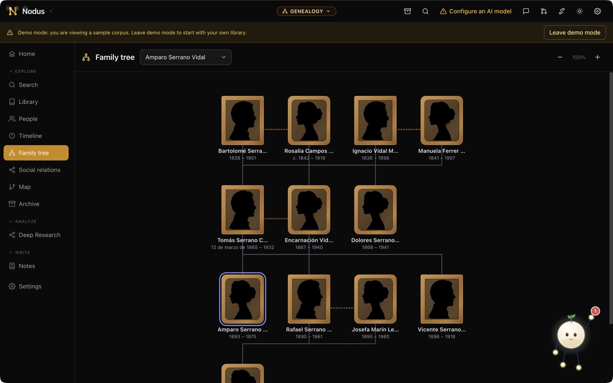
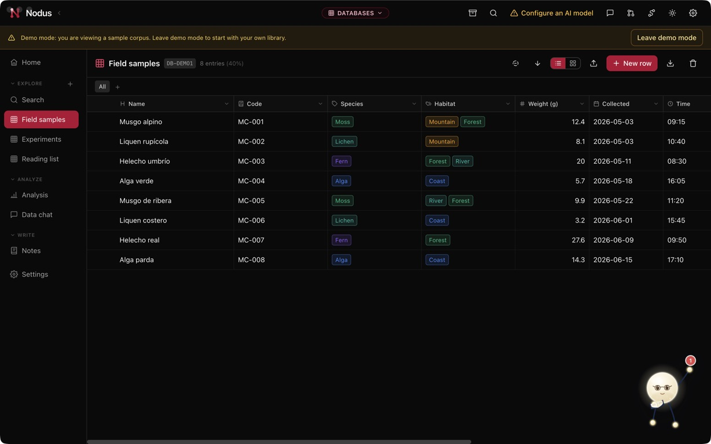
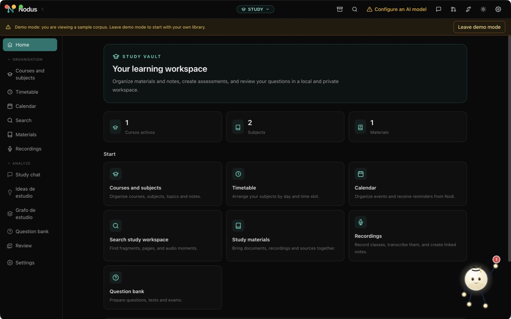
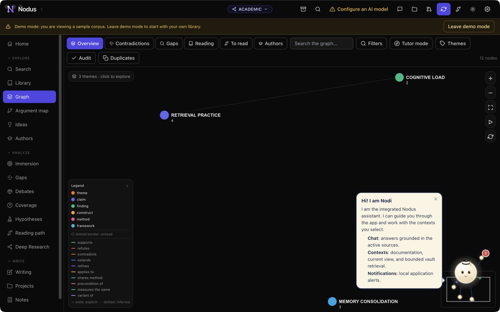

  

<h1 align="center">Nodus</h1>

<strong>One place for research, teaching and study</strong>

  <a href="https://github.com/Drakonis96/nodus/releases/latest">Download Nodus</a> ·
  <a href="https://drakonis96.github.io/nodus/">Visit the website</a> ·
  <a href="https://drakonis96.github.io/nodus/demo/">Try the interactive tour</a>

Nodus is a desktop centre for university work. It brings sources, notes, data, ideas and learning materials together without forcing every project into the same shape.

Each vault is a focused workspace. Researchers can build a connected corpus, historians can document a family tree, teams can explore structured data and students can organise an entire degree. You can move between them from one calm, consistent app.

Nodus is local first. Your vaults and search indexes live on your computer. You decide when a feature may use an online AI provider, and you can also work with compatible local models.

## Install Nodus

Download the installer for your computer and open it. There is no server to configure and no account is required to begin.

| Platform | Latest installer |
| --- | --- |
| macOS with Apple silicon | [Download DMG](https://github.com/Drakonis96/nodus/releases/download/v2.2.0/Nodus-2.2.0-mac-arm64.dmg) |
| Windows 10 and 11 | [Download EXE](https://github.com/Drakonis96/nodus/releases/download/v2.2.0/Nodus-2.2.0-win-x64.exe) |
| Ubuntu and Debian | [Download DEB](https://github.com/Drakonis96/nodus/releases/download/v2.2.0/Nodus-2.2.0-linux-amd64.deb) |
| Other Linux distributions | [Download AppImage](https://github.com/Drakonis96/nodus/releases/download/v2.2.0/Nodus-2.2.0-linux-x86_64.AppImage) |

The [latest release page](https://github.com/Drakonis96/nodus/releases/latest) always contains the newest available installers and release notes.

## One app, four working vaults

### Academic vault

Build a research corpus from Zotero and turn reading into connected knowledge. Nodus can surface themes, ideas, agreements, contradictions and unanswered questions while keeping every claim close to its source.

Its strongest tools include semantic search, an idea graph, author profiles, coverage and gap analysis, reading paths, argument maps, Deep Research and a writing workshop with verifiable citations. A Word companion is available for bringing Nodus context into a manuscript.

### Genealogy vault

Document people, relationships and evidence in a research-led family archive. The tree, timeline, map and records library stay connected so that a family story never loses its documentary basis.

You can import and export GEDCOM, attach records to people and events, review suggested relationships before accepting them and investigate a lineage with dedicated research tools.

### Databases vault

Create approachable databases for projects that do not fit a spreadsheet. Tables support typed fields, relations, formulas, rollups, filters and reusable views.

CSV import makes it easy to begin with existing material. Analysis, chat and AI-assisted columns help you classify records, find patterns and answer questions across the dataset.

### Study vault

Organise subjects, reading, class notes, recordings and deadlines in one place. Materials can include documents, PDFs, EPUB books and audio, with tools for transcription and focused reading.

Nodus turns those materials into study support grounded in your own course content. It includes course planning, connected ideas, a subject graph, question banks, practice tests, exams, flashcards and spaced review.

## Meet Nodi

Nodi is the friendly guide that lives inside Nodus. It helps new users understand a vault, points out useful next steps and keeps notifications easy to follow without taking over the workspace.

  

## Made for serious academic work

- Separate vaults keep unrelated projects and roles from becoming one large, confusing library
- Local storage and encrypted backups help institutions retain control of their work
- Demo modes let anyone explore realistic workspaces before importing personal material
- English, Spanish, French and other interface languages support international teams and classrooms
- Light and dark themes make long reading and writing sessions more comfortable

Nodus is useful for individual work today and is designed with universities, research groups, teaching teams and learning communities in mind.

## Roadmap

Nodus is growing through new vaults rather than adding every possible tool to one menu.

| Vault | What it will bring |
| --- | --- |
| Teaching | Course planning, learning materials, assessment and feedback in one teaching workspace |
| Primary sources | Archival description, source criticism and evidence-led work with historical material |
| Testimonies | Interviews, transcription, coding and oral history workflows |
| Worldbuilding | Characters, places, rules and narratives for research-based creative projects |

Teaching and Worldbuilding can already be opened as previews. Primary Sources and Testimonies are planned next. Preview vaults are clearly marked in the app and are not presented as finished features.

## Explore before importing anything

Every working vault includes a demo mode with sample content. It is the quickest way to understand how Nodus feels and what each workspace can do.

You can also visit the [interactive browser tour](https://drakonis96.github.io/nodus/demo/) without installing the app.

## Open and evolving

Nodus is released under the [MIT License](LICENSE). Ideas, bug reports and academic use cases are welcome through [GitHub Issues](https://github.com/Drakonis96/nodus/issues).
