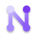
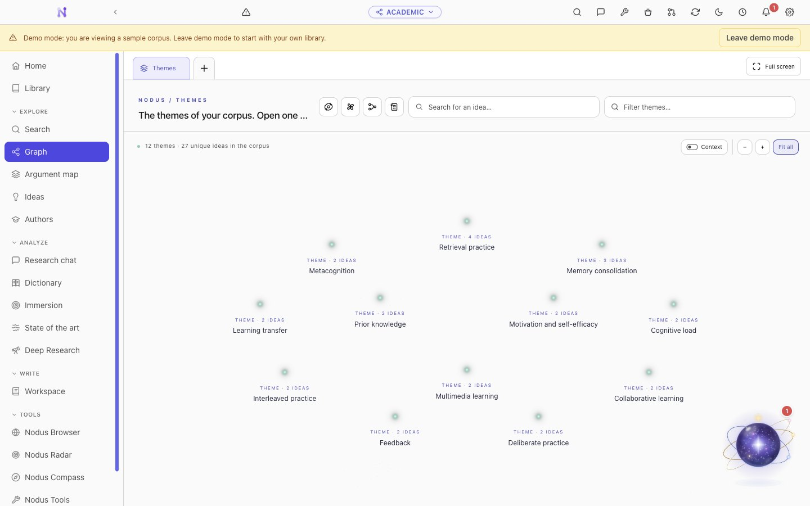
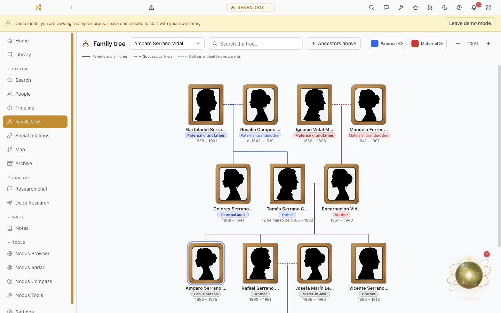
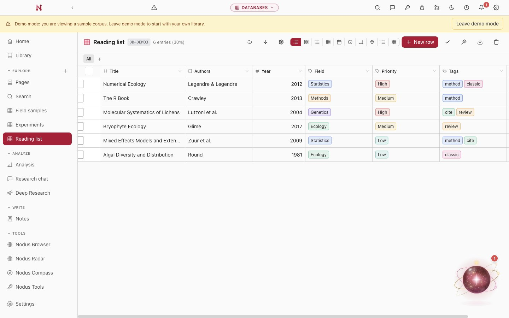
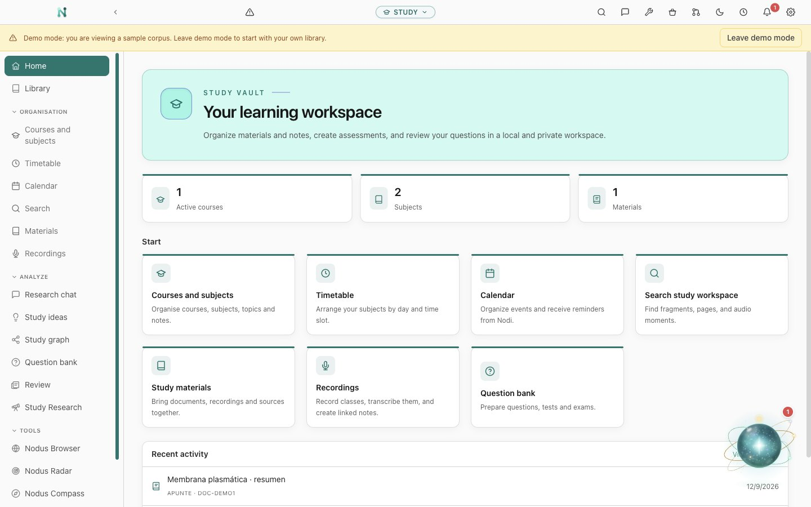
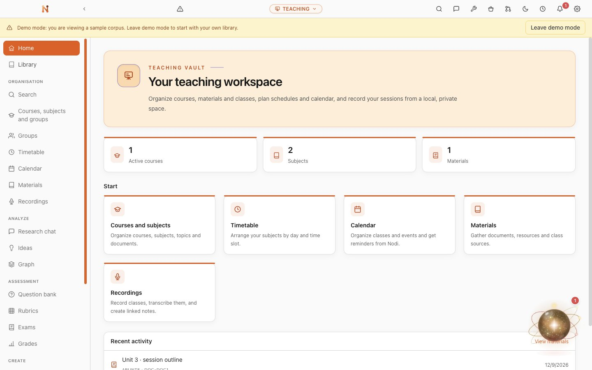
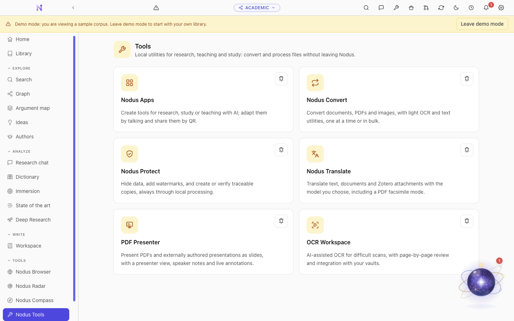
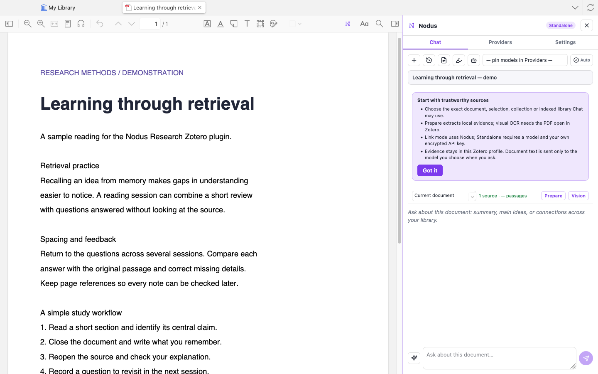
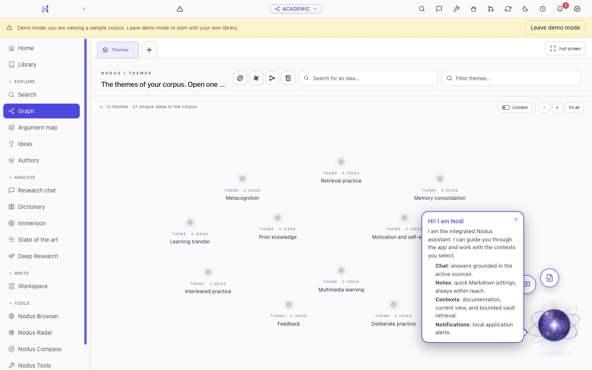

  

<h1 align="center">Nodus</h1>

<strong>One place for research, teaching and study</strong>

  <a href="https://github.com/Drakonis96/nodus/releases/latest">Download Nodus</a> ·
  <a href="https://drakonis96.github.io/nodus/">Visit the website</a> ·
  <a href="https://drakonis96.github.io/nodus/demo/">Try the interactive tour</a>

  
  

Nodus is a desktop centre for university work. It brings sources, notes, data, ideas and learning materials together without forcing every project into the same shape.

Each vault is a focused workspace. Researchers can build a connected corpus, historians can document a family tree, teams can explore structured data, teachers can plan and assess their courses, and students can organise an entire degree. You can move between them from one calm, consistent app.

Nodus is local first. Your vaults and search indexes live on your computer. You decide when a feature may use an online AI provider, and you can also work with compatible local models.

## A library shared by every vault

Nodus keeps one cross-vault Library inside `nodus-library`, nested under the
backup folder you choose. It can mirror a complete Zotero library with its
collection hierarchy and stable item keys, import RIS, BibTeX and CSL JSON from
Mendeley or other managers, or accept local documents directly.

Each original remains separate from a clean Markdown reading copy, extracted
figures, structured tables, page mappings, highlights, notes and document chat.
The reader can briefly show the matching original page or open the full original
without modifying it. A document can then be linked into any compatible vault
for search and analysis without duplicating the global copy. See the
[architecture, recovery and privacy guide](docs/global-library.md).

## Install Nodus

Download the installer for your computer and open it. There is no server to configure and no account is required to begin.

| Platform | Latest installer |
| --- | --- |
| macOS with Apple silicon | [Download DMG](https://github.com/Drakonis96/nodus/releases/latest/download/Nodus-mac-arm64.dmg) |
| Windows 10 and 11 | [Download EXE](https://github.com/Drakonis96/nodus/releases/latest/download/Nodus-win-x64.exe) |
| Ubuntu and Debian | [Download DEB](https://github.com/Drakonis96/nodus/releases/latest/download/Nodus-linux-amd64.deb) |
| Other Linux distributions | [Download AppImage](https://github.com/Drakonis96/nodus/releases/latest/download/Nodus-linux-x86_64.AppImage) |

The standalone Zotero plugin is available from the same release as [nodus-zotero.xpi](https://github.com/Drakonis96/nodus/releases/latest/download/nodus-zotero.xpi). In Zotero, open **Tools → Add-ons**, choose **Install Add-on From File**, and select the downloaded file.

The [latest release page](https://github.com/Drakonis96/nodus/releases/latest) always contains the newest available installers and release notes.

## One app, five working vaults

### Academic vault

Build a research corpus from Zotero and turn reading into connected knowledge. Nodus can surface themes, ideas, agreements, contradictions and unanswered questions while keeping every claim close to its source.

Its strongest tools include semantic search, an idea graph, author profiles, coverage and gap analysis, reading paths, argument maps, Deep Research and a writing workshop with verifiable citations. A Word companion is available for bringing Nodus context into a manuscript.

### Genealogy vault

Document people, relationships and evidence in a research-led family archive. The tree, timeline, map and records library stay connected so that a family story never loses its documentary basis.

You can import and export GEDCOM, attach records to people and events, review suggested relationships before accepting them and investigate a lineage with dedicated research tools.

### Databases vault

Create approachable databases for projects that do not fit a spreadsheet. Tables support typed fields, relations, formulas, rollups, filters and reusable views.

CSV import makes it easy to begin with existing material. Analysis, chat and AI-assisted columns help you classify records, find patterns and answer questions across the dataset.

### Study vault

Organise subjects, reading, class notes, recordings and deadlines in one place. Materials can include documents, PDFs, EPUB books and audio, with tools for transcription and focused reading.

Nodus turns those materials into study support grounded in your own course content. It includes course planning, connected ideas, a subject graph, question banks, practice tests, exams, flashcards and spaced review.

### Teaching vault

Plan academic years, courses, subjects and teaching groups in a workspace built for educators. Timetables, calendars, materials and recordings remain connected to the classes they support.

Teaching tools cover private student rosters, gradebooks, reusable rubrics and exam building. AI can generate teaching materials, questions and rubric structures, but Nodus does not send rosters, grades or student answers to a model and does not use AI to grade, profile or evaluate students.

## Nodus Toolkit

The Toolkit brings practical document tools together in every vault. Convert changes files between common formats, Protect combines files and adds permanent redactions, watermarks and traceable copies, and Translate works with text, files and Zotero attachments while preserving DOCX and EPUB structure. PDF Presenter and OCR Workspace complete the set.

You can open material from disk or from compatible vault sources, then save the result, share it or return it to the vault. Nodus Protect processes documents entirely on your computer and never sends them to an AI provider. Translate only uses the model you choose when you ask it to.

## Zotero plugin

The standalone Zotero plugin brings Nodus search into your reference manager. It indexes PDF, EPUB and HTML attachments so you can search across them and receive answers with exact passages and page citations.

Semantic search works across languages and combines with keyword search. The index stays in your Zotero profile, Vision can read scanned pages, figures, tables and formulas, and an evidence audit highlights claims that need stronger support.

## Meet Nodi

Nodi is the friendly guide that lives inside Nodus. It helps new users understand a vault, points out useful next steps and keeps notifications easy to follow without taking over the workspace.

  

## Share a vault with Nodus Server

Nodus Server shares a selected copy of a vault while the original database and documents stay on the owner's computer. Readers can search published spaces from Nodus, ChatGPT or Claude. Owners choose what is included and can give each person reader, writer or owner access.

Nodus can now start a private server from Settings for access on a phone or tablet through Tailscale or the local network. Groups can instead run the Docker version on their own server and manage spaces, people and devices from the web. Both options are experimental. See the [Nodus Server installation guide](server/README.md).

## Cite Nodus

If Nodus contributes substantially to research that leads to a publication, please cite the version you used. The repository provides machine-readable citation metadata in [`CITATION.cff`](CITATION.cff), which GitHub can render in APA and BibTeX formats.

## Roadmap

Nodus is growing through new vaults rather than adding every possible tool to one menu.

| Project | Status | What it will bring |
| --- | --- | --- |
| Primary sources vault | Alpha | Archival description, source criticism and evidence-led work with historical material |
| Testimonies vault | Alpha | Interviews, transcription, coding and oral history workflows |
| Worldbuilding vault | Alpha | Characters, places, rules and narratives for research-based creative projects |
| iOS, iPadOS and Android companion app | In development | Access to shared vaults from a phone or tablet |

The three vaults are in alpha and may change as they develop. They are clearly marked in the app and are not presented as finished features.

## Explore before importing anything

Every working vault includes a demo mode with sample content. It is the quickest way to understand how Nodus feels and what each workspace can do.

You can also visit the [interactive browser tour](https://drakonis96.github.io/nodus/demo/) without installing the app.

## Open and evolving

Nodus 4.0.0 and later are released exclusively under [GNU AGPL v3](LICENSE), SPDX `AGPL-3.0-only`. Published versions through 3.2.7 remain under MIT. Every build links to its [Corresponding Source](SOURCE_CODE.md). The [privacy policy](PRIVACY.md), [third-party notices](THIRD_PARTY_NOTICES.md) and [deployment checklist](legal/RGPD_DEPLOYMENT_CHECKLIST.md) document the privacy and licensing boundaries of each installation. Ideas, bug reports and academic use cases are welcome through [GitHub Issues](https://github.com/Drakonis96/nodus/issues).

Before participating, read the [contribution guide](CONTRIBUTING.md) and [Code of Conduct](CODE_OF_CONDUCT.md). Report vulnerabilities privately according to the [security policy](SECURITY.md).
