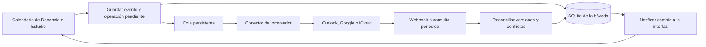

# Integración de calendarios y sincronización automática

Investigación inicial del 27 de septiembre de 2026 sobre `77fd1561`, seguida de la implementación descrita a continuación. No se han conectado cuentas reales durante las pruebas.

**Alternativa investigada inicialmente (no aplicada para Google/Outlook):** crear un motor común para los calendarios de Docencia y Estudio, con Microsoft Graph para Outlook, Google Calendar API para Google y un conector Apple independiente. La primera entrega debe sincronizar automáticamente altas, modificaciones y bajas desde Nodus. La sincronización de vuelta y el funcionamiento continuo con Nodus cerrado requieren trabajo adicional.

Interpreto «todos los calendarios» como los de Docencia y Estudio y sus destinos externos conectados. Cada bóveda conserva sus eventos y el usuario selecciona qué cuentas/calendarios enlazar; no se mezclan automáticamente calendarios personales o de otras bóvedas.

## Entrega implementada: Outlook manual y Apple automático

Decisión del usuario: no contratar servicios adicionales. Outlook exporta `.ics`; solo Apple tiene sincronización automática. Google conserva su formulario manual. No hay registro OAuth de Nodus, claves de proveedor, suscripciones web ni servidor nuevo.

### Uso

- En **Calendario** de Estudio o Docencia, **Exportar a Outlook (.ics)** guarda el calendario completo. También se puede exportar un evento desde su ficha. Outlook importa ese archivo manualmente; la importación es una copia, no una suscripción. Reimportar puede duplicar eventos según el cliente. La ayuda de la interfaz describe Outlook web; las versiones de escritorio también admiten importar iCalendar. [Documentación de Microsoft](https://support.microsoft.com/en-us/outlook/import-or-subscribe-to-a-calendar-in-outlook-com-or-outlook-on-the-web).
- En macOS, abrir **Apple Calendar → Elegir calendario de Apple**, conceder acceso completo, seleccionar un calendario y pulsar **Activar sincronización**. La activación incluye los eventos existentes de esa bóveda. El selector admite calendarios locales editables e iCloud; excluye Google, Exchange y otros proveedores aunque estén presentes en Calendario.
- Crear, editar o eliminar eventos en Nodus actualiza sus copias en el destino. Nodus debe estar abierto. El cambio desde la interfaz despierta el servicio después de 250 ms; una revisión cada cinco segundos recoge cambios de otras rutas. Se procesa cada bóveda configurada con su propia conexión SQLite, aunque no esté seleccionada en la interfaz.
- La dirección es **Nodus → Apple**. Las ediciones externas no se importan ni se consultan continuamente: una nueva edición en Nodus reemplaza los campos compartidos de su copia. La confirmación es del almacén local EventKit; Apple controla cuándo llega a iCloud y a otros dispositivos.
- Desactivar conserva las copias remotas. Al reactivar se aplican también las modificaciones y eliminaciones pendientes. Cambiar de destino conserva las copias del calendario anterior, que deja de actualizarse.
- Apple sincroniza los eventos de `study_calendar_events`, que alimentan la vista Calendario. No transforma horarios semanales en recurrencias ni sincroniza bloques de planificación. La exportación completa `.ics` conserva el alcance anterior: eventos y bloques.

### Implementación y recuperación

- `electron/calendar/ical.ts`: fechas UTC, eventos de día completo con final exclusivo, duración predeterminada de una hora cuando falta el final, alarmas absolutas, escape de texto y plegado a 75 bytes sin cortar caracteres UTF-8.
- `build/apple-calendar/AppleCalendar.mm`: módulo Node-API asíncrono que usa EventKit dentro del proceso firmado de Nodus. No usa AppleScript, contraseñas de iCloud ni APIs de Google/Microsoft. Consulta fuentes y calendarios, pero solo modifica eventos con su marcador exacto de propiedad en el calendario seleccionado. Rechaza series, invitados, organizadores y coincidencias ambiguas.
- EventKit no publica un identificador de proveedor: la selección admite fuentes locales o CalDAV cuyo nombre es `iCloud`. Una fuente no reconocida queda fuera. El marcador `[Nodus:…]` en las notas permite recuperar una escritura cuyo identificador no llegó a guardarse después de un cierre inesperado; no debe eliminarse manualmente.
- `appleCalendarCore.ts`, `appleCalendarState.ts` y `appleCalendarSync.ts`: correspondencias por bóveda y calendario, huellas de los campos compartidos e intención persistida **antes** de escribir en Apple. Los reintentos reproducen la operación pendiente antes de aplicar cambios nuevos. Un borrado local posterior a una escritura de confirmación perdida también se recupera. El estado se guarda atómicamente con permisos `0600` en `userData/calendar-sync/apple.json`, fuera de las tablas compartidas de la bóveda.
- Los errores nativos mantienen operaciones pendientes con espera progresiva hasta cinco minutos. Una configuración ilegible o imposible de guardar detiene las escrituras para evitar perder correspondencias; no se borra ni reinicializa silenciosamente. Las bóvedas inaccesibles no se interpretan como calendarios vacíos. Al desactivar durante un lote solo termina la operación ya en curso.
- Se comparten título, descripción, URL, fechas y alarma. Las notas de estudio, relaciones académicas y estado de avisos de Nodus no se envían automáticamente a Apple.

### Compilación y permisos

`npm run build:apple-calendar` compila la arquitectura local en macOS con Xcode Command Line Tools. `predev` y `prebuild` lo ejecutan automáticamente. `beforePack` genera la arquitectura elegida por electron-builder; `afterPack` comprueba el binario antes de firmar. Windows/Linux omiten este módulo y conservan la exportación manual.

La aplicación macOS empaquetada incluye `NSCalendarsUsageDescription`, `NSCalendarsFullAccessUsageDescription` y el entitlement de calendarios. Se pide acceso completo solo al pulsar **Elegir calendario de Apple**, nunca al arrancar. En macOS 14 o posterior se usa `requestFullAccessToEventsWithCompletion:`; se conserva la API anterior para sistemas compatibles más antiguos. Las escrituras no sustituyen el permiso de lectura necesario para actualizar y eliminar copias seguras. [Acceso al almacén](https://developer.apple.com/documentation/eventkit/accessing-the-event-store), [migración de permisos](https://developer.apple.com/documentation/technotes/tn3153-adopting-api-changes-for-eventkit-in-ios-macos-and-watchos).

El Electron genérico de `npm run dev` no incorpora las descripciones de privacidad de Nodus. El módulo detecta esa situación antes de pedir acceso para evitar un cierre de TCC; la prueba del consentimiento debe hacerse con la aplicación macOS empaquetada. No se modifica el Electron de desarrollo compartido ni se utilizan certificados nuevos.

### Validación

- Pruebas de integración con un adaptador EventKit simulado: altas/ediciones/bajas, ausencia de duplicados, reinicio después de guardar sin recibir confirmación, borrado durante esa interrupción, fallos de disco, permiso denegado, separación de bóvedas, desactivación y reactivación.
- Pruebas de iCalendar: Unicode, escape de saltos de línea, plegado por bytes, recordatorios, eventos de día completo y cambio horario.
- Pruebas existentes de estudio, distribución del calendario, traducciones y configuración de electron-builder; comprobación de tipos y compilación completa.
- Compilación nativa arm64/x64 y carga del módulo en Node y Electron, consultando solo el estado de autorización.
- Flujo de interfaz probado en Chromium con API simulada: consentimiento explícito, error de permiso, selección obligatoria del destino, activar/desactivar y exportación completa/individual, incluida cancelación y error de guardado.
- Pendiente de comprobación con una cuenta real: diálogo de consentimiento de la aplicación empaquetada, altas/ediciones/bajas en iCloud y propagación a otros dispositivos. No se han tocado calendarios del usuario para estas pruebas.

---

Los apartados siguientes conservan la investigación inicial de alternativas y describen el código previo a esta entrega.

## 1. Qué había en Nodus al iniciar la investigación

| Hallazgo comprobado | Evidencia en el repositorio | Consecuencia |
| --- | --- | --- |
| Docencia usa la vista `studyCalendar`, igual que Estudio. | [TeachingSidebar.tsx](../src/components/TeachingSidebar.tsx), [registro de vistas](../src/app/views/study.tsx) | Un motor compartido cubre ambos tipos de bóveda. Compartir código no significa compartir sus datos. |
| Los eventos se guardan en SQLite mediante `createStudyCalendarEvent`, `updateStudyCalendarEvent` y `deleteStudyCalendarEvent`. El borrado es lógico, con `deleted_at`. | [studyLearningRepo.ts](../electron/db/studyLearningRepo.ts), funciones desde la línea 191 | Hay puntos claros donde registrar operaciones pendientes y propagar eliminaciones. |
| «Añadir a Google Calendar» abre una URL `action=TEMPLATE`. | [academic.ts](../electron/ipc/academic.ts), líneas 1482–1493 | Es un formulario de creación manual; no hay vínculo con el evento remoto. |
| «Añadir a iCloud» escribe un `.ics` temporal y lo abre con la aplicación asociada al archivo. | [academic.ts](../electron/ipc/academic.ts), líneas 1495–1498 | No conecta con iCloud ni garantiza que el archivo se abra en Apple Calendar. |
| La API externa solo admite `google` e `icloud`. | [academic.ts](../shared/api/academic.ts), línea 609 | Outlook no tiene conector en este flujo. |
| La vista carga al montarse y después de sus propias operaciones de edición. | [StudyCalendarView.tsx](../src/views/StudyCalendarView.tsx), líneas 55–80 | Hace falta avisar a la vista cuando un cambio llegue en segundo plano. |
| El modelo no incluye cuenta/calendario remoto, versión remota, zona horaria explícita ni recurrencia. | [studyPlanner.ts](../shared/studyPlanner.ts) | La bidireccionalidad requiere ampliar el modelo y guardar correspondencias. |
| La exportación completa incluye eventos y bloques de planificación; la vista de calendario lee solo `events`. Los horarios semanales son otro modelo. | [renderStudyPlannerIcs](../electron/db/studyLearningRepo.ts), [studySchedule.ts](../shared/studySchedule.ts) | Debe definirse explícitamente qué entidades se sincronizan. |

Nodus ya tiene infraestructura aprovechable: [sincronización por grupos de tablas](../electron/db/syncTables.ts), [publicación automática de bóvedas](../electron/serverSync/serverSyncService.ts), [operaciones con identidad y reloj lógico](../shared/syncOperations.ts), [SSE del servidor](../server/lib/routes/api.mjs) y [almacenamiento de secretos con `safeStorage`](../electron/secrets/secretStore.ts). Las [instantáneas de estudio](../electron/serverSync/serverSnapshot.ts) incluyen `study_calendar_events`.

Esto no equivale a tener integración externa: faltan autorización de los proveedores, correspondencias entre eventos, reintentos específicos y recepción de cambios. Además, hay que separar las credenciales de las tablas que viajan con la bóveda; el grupo `study_` incorpora tablas por prefijo.

## 2. Integración con Microsoft Outlook Calendar

La vía recomendada es **Microsoft Graph**. Su API permite crear eventos en un calendario del usuario con permisos delegados `Calendars.ReadWrite`, tanto para cuentas personales como profesionales/educativas. El caso inicial sería Outlook.com y buzones Microsoft 365 accesibles por Graph; no cualquier calendario local o cuenta de otro proveedor visible dentro de la aplicación Outlook. [Crear eventos](https://learn.microsoft.com/en-us/graph/api/calendar-post-events?view=graph-rest-1.0), [permisos](https://learn.microsoft.com/en-us/graph/permissions-reference).

Flujo propuesto:

1. Registrar Nodus en Microsoft Entra para el público previsto, incluidas cuentas personales si se desean admitir.
2. Añadir «Conectar Outlook» mediante MSAL Node y autorización con código + PKCE en el navegador del sistema. Electron funciona como cliente público, sin un secreto de aplicación incrustado. Persistir la caché de tokens cifrada y gestionar renovación/reautenticación. [MSAL Node](https://learn.microsoft.com/en-us/entra/msal/javascript/node/initialize-public-client-application), [configuración de escritorio](https://learn.microsoft.com/en-us/azure/active-directory/develop/scenario-desktop-app-registration).
3. Solicitar acceso a calendarios y los permisos de identidad/renovación necesarios; evitar pedir correo o contactos. Las políticas de una universidad pueden limitar el consentimiento, por lo que una cuenta institucional debe formar parte del piloto.
4. Permitir seleccionar un calendario editable o crear uno dedicado, por ejemplo «Nodus · Docencia · Curso 2026–27». El nombre es una etiqueta; la asociación usa identificadores estables.
5. Usar `POST /me/calendars/{calendarId}/events` para crear y `PATCH`/`DELETE` sobre el evento correspondiente para mantenerlo actualizado. Guardar el ID remoto después de crear, sin abrir formularios. [Creación](https://learn.microsoft.com/en-us/graph/api/calendar-post-events?view=graph-rest-1.0), [actualización](https://learn.microsoft.com/en-us/graph/api/event-update?view=graph-rest-1.0).

Para soportar reintentos, usar un `transactionId` estable por alta lógica. Solicitar `Prefer: IdType="ImmutableId"` de manera consistente, también al crear suscripciones, y guardar versión remota y última proyección sincronizada. Los identificadores inmutables tienen límites: siguen siendo estables dentro del mismo buzón, no necesariamente tras exportaciones/reimportaciones. [Identificadores inmutables](https://learn.microsoft.com/en-us/graph/outlook-immutable-id), [modelo de evento](https://learn.microsoft.com/en-us/graph/api/resources/event?view=graph-rest-1.0).

**Cambios de Outlook hacia Nodus:** suscribirse a `created,updated,deleted` en `/me/events`, recibir el aviso y consultar/aplicar el cambio solo si pertenece al alcance elegido. Los avisos de eventos abarcan el buzón; no deben convertirse en una importación indiscriminada. Las suscripciones caducan y hay que renovarlas; las básicas de Outlook tienen una duración máxima documentada de aproximadamente siete días. [Notificaciones de Outlook](https://learn.microsoft.com/en-us/graph/outlook-change-notifications-overview), [duración de suscripciones](https://learn.microsoft.com/en-us/graph/api/resources/subscription?view=graph-rest-1.0).

Los webhooks necesitan una URL HTTPS pública: un servidor local de Electron no sirve como receptor accesible permanentemente. El receptor debe validar el alta y `clientState`, persistir el aviso y responder con rapidez; el trabajo se procesa después. Hay que contemplar avisos repetidos, perdidos y de ciclo de vida. [Recepción por webhook](https://learn.microsoft.com/en-us/graph/change-notifications-delivery-webhooks).

Para recuperar cambios, Graph proporciona consultas delta por intervalo temporal y enlaces de continuación. Deben conservarse por calendario/intervalo, sin confundir la salida de una ventana con un borrado global. La documentación v1.0 consultada enumera `/me/calendarView/delta`; la ruta y paginación del calendario secundario elegido deben verificarse en el piloto. Si no quedan confirmadas, se puede reconciliar mediante lectura paginada del calendario y comparación de versiones. No basar producción en el delta sin intervalo de `/beta`. [Delta de eventos](https://learn.microsoft.com/en-us/graph/api/event-delta?view=graph-rest-1.0), [guía de delta](https://learn.microsoft.com/en-us/graph/delta-query-events), [lectura de una vista de calendario](https://learn.microsoft.com/en-us/graph/api/calendar-list-calendarview?view=graph-rest-1.0).

Los calendarios compartidos/delegados necesitan un alcance posterior: los permisos delegados de compartición no permiten suscribirse a cambios de otra bandeja como si fuera propia. Requerir permisos de aplicación y autorización institucional es una arquitectura distinta al conector personal. [Limitaciones de las notificaciones](https://learn.microsoft.com/en-us/graph/outlook-change-notifications-overview).

## 3. Qué significa «en tiempo real» para cada proveedor

| Destino | Escrituras desde Nodus | Detección de cambios externos | Alcance y limitación |
| --- | --- | --- | --- |
| Outlook | Microsoft Graph al guardar | Webhooks + recuperación/reconciliación | Automático y orientado a baja latencia; sin prometer un plazo fijo de entrega. |
| Google Calendar | Calendar API al guardar | `events.watch` + sincronización incremental | Requiere OAuth, renovar canales y recuperarse de avisos perdidos. |
| Apple Calendar en macOS | EventKit a través de un componente nativo | `EKEventStoreChanged` y nueva lectura | Solo macOS; la propagación a iCloud/otros dispositivos depende del sistema. |
| iCloud desde varias plataformas | Conector CalDAV, sujeto a prueba de compatibilidad | Consulta periódica, ETag y `sync-token` si se anuncia soporte | No se ha identificado en las fuentes consultadas un webhook público general equivalente al de Graph. |
| Suscripción a una URL ICS | Publicar una fuente actualizada | El cliente externo decide cuándo consultarla | Útil para compartir en lectura; no satisface una actualización rápida controlada por Nodus. |

**Google:** sustituir el enlace actual por llamadas API. Si usamos calendarios secundarios creados por Nodus, estudiar `calendar.app.created`; para calendarios existentes, elegir los permisos mínimos correspondientes, incluyendo descubrimiento si se necesita. Registrar el cliente OAuth de escritorio y prever la verificación de permisos sensibles que corresponda. [Permisos de Calendar](https://developers.google.com/workspace/calendar/api/auth), [OAuth de escritorio](https://developers.google.com/identity/protocols/oauth2/native-app), [verificación](https://developers.google.com/identity/protocols/oauth2/production-readiness/sensitive-scope-verification).

Los avisos de Google no contienen el evento: se consulta después usando `syncToken`. Un `410 Gone` obliga a reconstruir el estado remoto, preservando antes los cambios locales pendientes. Los canales no se renuevan solos y los mensajes no son totalmente fiables, por lo que también hace falta reconciliación periódica. [Push de Google](https://developers.google.com/workspace/calendar/api/guides/push), [sincronización incremental](https://developers.google.com/workspace/calendar/api/guides/sync).

**Apple:** EventKit es una buena opción para una primera integración en macOS, con permisos del sistema y un puente nativo desde Electron. La notificación invalida los objetos leídos y exige volver a consultar; no describe cada modificación. Puede acceder a calendarios que el usuario ya tenga configurados en el sistema, pero no sustituye una solución multiplataforma. [Acceso al almacén](https://developer.apple.com/documentation/eventkit/accessing-the-event-store), [notificación de cambios](https://developer.apple.com/documentation/eventkit/ekeventstorechangednotification).

Para iCloud multiplataforma, validar CalDAV mediante una prueba de descubrimiento, lectura, escritura, actualización y borrado. Apple documenta contraseñas específicas de aplicación con doble factor y autorización mediante Apple Account para aplicaciones compatibles; esa autorización no debe confundirse con una API de calendarios disponible automáticamente para Nodus. No se ha verificado elegibilidad para esa vía. La alternativa a probar es la contraseña específica, nunca la contraseña principal. El uso de `sync-collection` depende de las capacidades anunciadas por el servidor. [Acceso de terceros a iCloud](https://support.apple.com/es-es/121539), [contraseñas específicas](https://support.apple.com/es-es/102654), [sincronización WebDAV](https://datatracker.ietf.org/doc/html/rfc6578).

**ICS:** importar un archivo produce una copia; suscribirse a una URL sí permite actualizaciones, pero Outlook advierte que pueden tardar más de 24 horas. Por eso no es la base recomendada para este requisito. [Importar frente a suscribirse en Outlook](https://support.microsoft.com/en-us/outlook/import-or-subscribe-to-a-calendar-in-outlook-com-or-outlook-on-the-web).

## 4. Motor común propuesto

El guardado local y la operación pendiente deben ser atómicos. Un trabajador procesa la cola sin bloquear la interfaz; puede agrupar ediciones consecutivas del mismo evento. Si falla la red, conserva el trabajo y reintenta con espera creciente y variación aleatoria, respetando `Retry-After`. Una reconexión, apertura de la aplicación o reactivación del equipo provoca una recuperación. [Límites y reintentos de Graph](https://learn.microsoft.com/en-us/graph/throttling).

Modelo mínimo adicional:

- `calendar_connections`: proveedor, identidad de cuenta, referencia al almacén seguro y estado de conexión.
- `calendar_bindings`: bóveda, calendario remoto, dirección y alcance elegido.
- `calendar_event_links`: evento local, vínculo, ID remoto, versión y última proyección confirmada; unicidad por destino y evento.
- `calendar_outbox`: operación durable, versión local, clave de idempotencia, intentos y próximo reintento.
- `calendar_sync_state`: cursores, suscripciones, expiración y última reconciliación.

La ubicación de estas tablas es una decisión explícita: vínculos lógicos replicables cuando corresponda; tokens, cursores del ejecutor y credenciales fuera de las exportaciones/replicaciones genéricas. Reutilizar el patrón de secretos existente con una API específica para calendarios.

Los cambios deben capturarse en la capa de datos/servicio, no únicamente en el botón Guardar. También pueden llegar desde otra máquina, una importación o `updateStudyPlannerItem`. Cada tarea conserva `vaultId` y utiliza el contexto de base de datos de esa bóveda, con independencia de la vista abierta. El trabajador recorre todas las conexiones habilitadas, incluidas bóvedas inactivas.

Para cada destino, comparar una proyección de campos compartidos. Cambios como `notified_at` o metadatos locales no deben provocar escrituras externas. Cuando llegue una actualización remota, registrar su origen y versión para evitar bucles. Si un evento está vinculado a varios proveedores, propagar la nueva versión aceptada a los otros destinos y reconocer el eco de las escrituras propias.

Con varios equipos, un único ejecutor por conexión —coordinado por el servidor o designado explícitamente— evita carreras. La idempotencia sigue siendo necesaria porque el proceso puede cerrarse después de crear el evento remoto y antes de guardar la respuesta local. La coordinación entre equipos no se resuelve solo con una cola SQLite en cada ordenador.

## 5. Aplicación abierta, cerrada y varios dispositivos

| Modalidad | Infraestructura | Comportamiento |
| --- | --- | --- |
| Local automática | Electron + credenciales locales | Envía al guardar; consulta cambios externos periódicamente mientras el proceso esté funcionando. Sin servidor público obligatorio. |
| Local con avisos | Lo anterior + receptor HTTPS y canal autenticado hacia Nodus | Reduce consultas y reacciona a webhooks. Si Nodus está cerrado, recupera cambios al abrir. El receptor puede limitarse a guardar avisos. |
| Continua | Coordinador y trabajador siempre activos, credenciales autorizadas en servidor | Puede continuar entre proveedores y aceptar trabajo de otros clientes aunque el escritorio esté apagado. Solo procesa cambios que hayan llegado al servidor. |

Recomiendo empezar por la modalidad local, que ya resuelve «creo un evento y se sincroniza automáticamente». Como valor inicial a medir, las consultas entrantes podrían hacerse cada 60–120 segundos en actividad y espaciarse en reposo. Es una decisión de diseño, no un plazo garantizado del proveedor.

Después, aprovechar Nodus Server/Cloudflare para los avisos y, si se quiere funcionamiento continuo, añadir un trabajador y almacenamiento de credenciales específico. Un webhook por sí solo no ejecuta la sincronización completa ni mantiene viva una aplicación cerrada.

EventKit sigue necesitando un Mac con el proceso correspondiente activo. Para incluir iCloud en una sincronización íntegramente ejecutada en servidor habría que validar el conector CalDAV; un receptor web no sustituye el almacén local de Apple.

El estado visible debe distinguir «Pendiente», «Sincronizando», «Sincronizado», «Sin conexión» y «Reconectar cuenta». «Sincronizado» significa que el proveedor confirmó la escritura; no que todos sus clientes ya la muestran. Graph documenta actualmente la latencia de notificaciones de `event` como desconocida; no conviene prometer segundos garantizados confundiendo esa fila con la de `calendar`. [Latencia documentada](https://learn.microsoft.com/en-us/graph/change-notifications-overview#latency).

## 6. Decisiones que evitan pérdidas y duplicados

- **Dirección inicial:** Nodus → destinos. Altas, ediciones y bajas de eventos vinculados. Si el destino se edita antes de incorporar bidireccionalidad, detectar divergencia y mostrarla antes de sobrescribirla.
- **Bidireccionalidad posterior:** importar eventos nuevos solo desde calendarios expresamente vinculados. Conservar curso, asignatura, tema y otros campos que el proveedor no representa. Resolver cambios concurrentes comparando con la última versión común, sin confiar únicamente en las horas de los dispositivos.
- **Borrados:** guardar tombstones y confirmar bajas por destino. Nunca interpretar un error, falta de permisos, respuesta parcial o evento fuera del intervalo como una eliminación. Desconectar una cuenta conserva por defecto los eventos ya creados.
- **Fechas:** añadir zona IANA; distinguir fecha civil de evento de día completo y fecha/hora. Resolver el final opcional mediante una duración explícita. Probar cambio de hora, eventos de varios días y representación del fin exclusivo de un día completo.
- **Recurrencias:** definir series, excepciones y cancelaciones antes de permitir edición bidireccional de clases recurrentes. Mientras no estén soportadas, mostrarlas con alcance limitado y sin reescribirlas perdiendo información.
- **Recordatorios:** traducir el aviso absoluto actual a la capacidad de cada proveedor; mostrar cualquier pérdida de precisión. Evitar avisos duplicados entre Nodus y el calendario si el usuario así lo configura.
- **Contenido compartido:** título, descripción elegida, fechas, enlace y recordatorio. Mantener las notas internas fuera de la proyección por defecto. Invitados y envío de convocatorias requieren una función específica.
- **Migración:** los eventos exportados manualmente no tienen un vínculo remoto guardado. El UID del ICS puede ayudar a identificar candidatos, pero título y fecha no prueban identidad. Ofrecer calendario dedicado y revisión de coincidencias antes de una carga inicial masiva.
- **Un conector por destino real:** no conectar la misma cuenta/calendario mediante Graph y EventKit simultáneamente sin detectar equivalencia.

Los horarios semanales requieren un proyecto de conversión adicional: fechas del curso, zona horaria, vacaciones, recurrencias y excepciones. No pueden tratarse como eventos fechados solo a partir de una celda de lunes a viernes. Los bloques de planificación sí tienen fecha, pero debe decidirse explícitamente si se incluyen junto a los eventos.

## 7. Entregas recomendadas y comprobaciones

| Entrega | Resultado verificable | Dependencias |
| --- | --- | --- |
| 1. Motor + Outlook | Conectar cuenta una vez; crear, editar y borrar en Nodus se refleja automáticamente en Outlook. Cola persistente y estado visible. | Registro Entra, calendarios de prueba personal e institucional, modelo de fechas y política de un ejecutor. |
| 2. Google y Apple | Mismo comportamiento desde Nodus en los destinos seleccionados. | OAuth de Google y verificación aplicable; prueba CalDAV o puente EventKit según plataforma. |
| 3. Vuelta automática | Cambios externos actualizan Nodus, con conflictos y recuperación; la vista se refresca sola. | Reconciliación, recurrencias acotadas, pruebas por calendario; webhooks si se necesita menor latencia. |
| 4. Continuidad entre equipos | Un coordinador procesa cambios recibidos aunque el escritorio esté cerrado. | Servicio permanente, credenciales de servidor, coordinación e integración con las operaciones de Nodus. |

Pruebas de aceptación al implementar: alta única tras reintentos; edición/borrado sobre la misma identidad; cierre inesperado entre petición y respuesta; reconexión tras trabajo sin red; renovación o revocación de credenciales; paginación y cursor inválido; webhook repetido/perdido; conflictos simultáneos; cambios de zona y horario de verano; cambio de bóveda durante una petición; dos equipos enviando el mismo evento; ausencia de secretos en exportaciones y logs.

La investigación valida la viabilidad mediante código y documentación oficial. Queda por comprobar con cuentas de prueba la política concreta de una universidad, las variantes delta de calendarios secundarios, la compatibilidad CalDAV de iCloud y las latencias reales. No se han ejecutado llamadas autenticadas ni pruebas de integración con cuentas personales.
