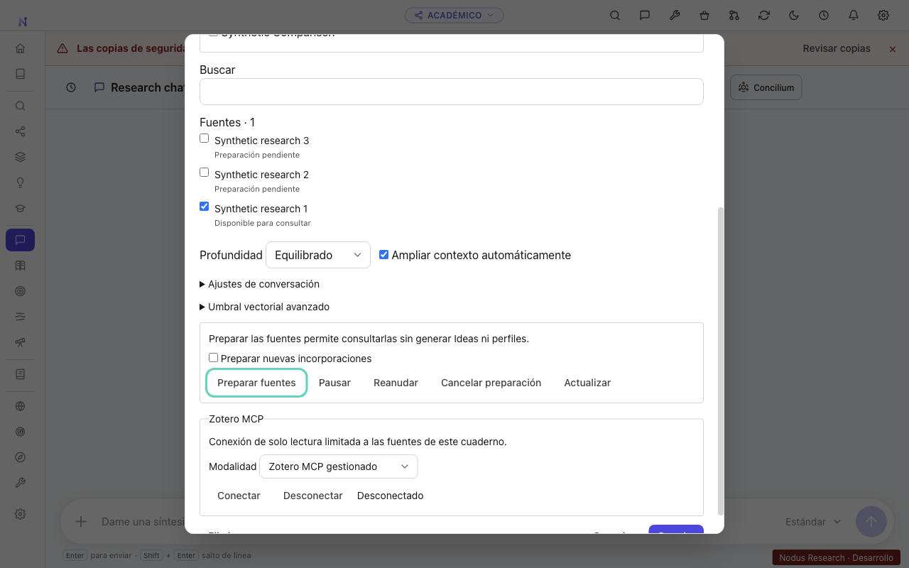
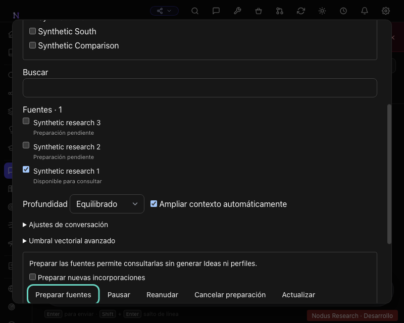

# Layered documentary research and notebooks

## Current acceptance status (2026-09-23)

Implemented on `codex/agentic-corpus-notebooks`; [PR #932](https://github.com/Drakonis96/nodus/pull/932)
remains draft and tracks [issue #931](https://github.com/Drakonis96/nodus/issues/931).
The sections below are a chronological engineering record. Statements such as
“no paid inference yet” describe their checkpoint, not the current state.

Implemented and exercised: additive notebook/provenance migrations, immutable
shared document indexes and atomic publications, durable preparation, shared
academic retrieval, explicit backend scopes, historical citation receipts,
bounded document reads, scoped managed stdio and external Streamable HTTP,
notebook UI, presets, translations and compatibility adapters. The complete
application build and lint passed at the legacy-citation checkpoint. The 682
script regression campaign plus corrections spans several commits; it is not a
claim that every script passed at the final head.

Current real macOS evidence uses Electron 43.4.0, Zotero 10.0.3, private CPython
3.12.14/build 20260901 and Zotero MCP 0.13.0 (`62335504262f4239961c4e782e342bd3bab4d5b2`).
The strengthened OS boundary now denies all outbound connections except explicit
disposable TCP loopback endpoints. See the corrective isolation record below;
older write-only checks must not be read as proof of network exclusion.

**Acceptance remains open.** On 24 September the long-report claim audit was
rebuilt around atomic premises and whole-report reconciliation (see
[Grounding closure](#grounding-closure-2026-09-24)). In the final live run
(application build `2a407f0e`) manual review found no retained factual claim
without source support in any of the four academic routes, with listed wording
and coherence defects; this is one run per route on a synthetic three-document
corpus, not a guarantee. The actual v5.6.0 upgrade passed on four disposable
platforms at `07f0e8bb`; the final-head results are recorded in the
[acceptance map](research-evidence/acceptance.md). Exhaustive failure-matrix
coverage is still incomplete. Citation existence and automatic support scores
are not factual acceptance. No release, tag or merge has been created.

## Development contract

This work extends academic Research Chat and Deep Research. Other vault engines
retain their contracts. Documents and compatible passage indexes are shared;
ideas, profiles and notebooks retain their vault ownership. Internet discovery is
part of Research Chat as one more step of the same flow: a SearXNG runtime
packaged with the application (private CPython, loopback only, started on demand
and stopped with the app) discovers candidate pages, Nodus merges and deduplicates
them, reads the ones worth reading, extracts passages and keeps their provenance,
so every web source can be cited and opened in the app's Browser. It runs when the
library is not enough, when the evidence needs contrasting or updating, or when
the user asks for it — never on every message, never as a substitute for the
library, and it never retries around an engine's bot check. The retrieval-quality
bar, the measured campaigns and what is still open are in
[the web search acceptance](research-evidence/web-search-acceptance.md).

The implementation starts from `f54995e7` on a dedicated branch. The pull request
must remain draft, with incremental verified commits and pushes. No release,
tag, merge or rewrite of published history is part of this work.

## Audit findings

- Library v2 already provides immutable canonical IDs, source identities and
  aliases. Zotero identity includes library type, library ID and item key.
- `hierarchicalRetrieval` already combines independent lexical/vector lanes and
  rank fusion. Some lower-level repositories still interpret an empty ID list
  as unscoped; those boundaries must fail closed.
- The passage embedding pipeline keeps its queue in memory. Documentary Index
  independently prepares passages and publishes them with the profile. Basic
  preparation must become durable and independent of enriched analysis.
- Research Chat has saved conversations and source filters; Deep Research also
  retrieves through writing-workshop snapshots. Both paths need the same scope.
- Nodus exposes an MCP server; consuming Zotero MCP requires a separate client.
- The old startup registered `nodus://` before its profile override. A bootstrap
  now applies the isolated profile before loading the application graph.

## Isolation

`NODUS_ISOLATED_ROOT` requires a canonical root and matching `isolation.json`.
The bootstrap configures Electron storage and private temporary directories
before dynamically loading the application. Isolated startup skips protocol
registration, automatic integrations, credential recovery, updates and deferred
plugin migration. The operating-system harness separately restricts writes for
the process tree; setting environment variables alone is not sufficient.

`scripts/research-isolation.mjs` creates only fresh synthetic profiles. Its macOS
sandbox test performs a real denied write against a disposable sentinel, never
against production. Production Nodus, Zotero and MCP directories are denied.
Application testing must not begin until this check succeeds.

On macOS, Chromium cannot install a nested Seatbelt sandbox. The isolated E2E
launcher therefore uses the already-inherited OS policy for the entire process
tree (`--no-sandbox` only in that launcher), retaining context isolation and the
restricted preload. Chromium's singleton also creates sockets outside its
configured temp directory; isolated runs use an exclusive profile-local lock,
while ordinary application startup retains Electron's singleton behavior.

### Verified startup, 2026-09-23

- Four isolation tests passed, including actual denied writes and duplicate
  profile ownership.
- Full production build and Electron TypeScript checks passed.
- A fresh Electron 43.4.0 instance reached the onboarding interface under the
  OS write boundary. Its native title and visible development badge were checked.
- All six audited database opens were inside the new profile. `userData`,
  `sessionData`, temporary storage, application data and downloads resolved below
  `/private/tmp/nodus-research-fk0o3o`.
- No model calls, production fixtures or real Zotero connection were involved.
  Startup screenshot and machine-readable report remain in that test root.

Only encrypted DeepSeek and OpenRouter credentials may be copied by a separate,
read-only fixture helper, following the user's explicit authorization. Never
load the production vault registry, preferences, databases or document corpus.
Real-model tests are limited to `deepseek-flash` and `baai/bge-m3` and a combined
USD 5 ceiling. No paid inference has been performed at this stage.

## Initial delivery checklist (historical; current status above)

- [ ] Isolated Electron and synthetic Zotero fixtures verified
- [ ] Managed Zotero MCP packaging and third-party notices
- [ ] Identity, source scope, evidence and preparation contracts
- [ ] Durable preparation and compatible shared indexes
- [ ] Shared retrieval and strict source boundaries
- [ ] Read-only scoped MCP integration and coexistence
- [ ] Academic notebooks and persistent source selections
- [ ] Presets, UI states and all translations
- [ ] Migrations, real Electron regression and provider evaluation

Checked items must describe executable, tested functionality, not designs.

### Incremental integration evidence, 2026-09-23

- `scripts/e2e-research-isolated.mjs --notebooks` passed in
  `/private/tmp/nodus-research-66KJg2`: three synthetic collections and sources,
  fixed membership with an exclusion, lexical publication without a provider,
  scoped evidence search, notebook editor and Escape focus handling. The report
  records actual OS write denial, private Electron paths and zero model calls.
- `scripts/verify-independent-zotero.mjs` passed in
  `/private/tmp/nodus-research-9DvBFN`: Zotero 10.0.3 with explicit private profile
  and data directory, synthetic PDF imports using Zotero's supported APIs, an
  independent local endpoint, and the private MCP runtime over stdio. It read
  physical page 1 containing NORTH23 and rejected an unselected item.
- `scripts/verify-managed-zotero-mcp.mjs` passed against a synthetic HTTP fixture
  in `/private/tmp/nodus-research-AUH7n3`, including the local server identity
  header, four read-only tools, revision checks and rejected identifiers.
- Six focused regression tests passed (notebooks, durable store, hierarchical
  retrieval and source filters). Renderer and Electron type checks and targeted
  lint passed. These are local macOS ARM64 results, not native cross-platform
  installation or external HTTP integration results.

The UI and basic shared retrieval are implemented incrementally. Deep Research,
all legacy writers, scoped citation navigation, managed connector settings,
packaging/signing across platforms and the paid comparison remain unfinished.
The two credential helpers exist but have not read production secrets. No paid
inference has been performed.

### Scoped execution and recovery milestone

Academic Deep Research now binds its four engine/approach routes to a backend
scope and a single evidence budget across discovery and sections. The profile
preparation barrier is removed from those routes. Scoped Ideas, gaps, themes,
contradictions and independent documentary evidence feed the existing writer
and citation-support auditor. Other vault engines retain their dispatch paths.

Shared passage citations include a persisted scope identifier. Direct reads
revalidate membership, source permissions and revision; the UI distinguishes
abstract evidence from full text. `/private/tmp/nodus-research-6ts8sn` passed the
real Electron citation lookup, fabricated-scope rejection and exclusion-after-
publication checks, with seven audited private database opens and zero calls.

Migration 181 adds backend-owned conversation provenance. Historical messages
stay visible, while only matching, server-recorded turns can re-enter a notebook
prompt. Deleting a notebook also removes its conversation selection metadata.

Source discovery now has transactional leases before the text fingerprint is
known, with restart recovery, fencing, pause, cancellation and bounded retries.
Traditional extraction stages files through the existing document worker without
creating Global Library records. Source maps are accepted only for matching
reader bytes; basic extraction explicitly disables remote OCR. Chunking retains
the 280/60 starting policy and adds a 4096-byte UTF-8 bound, versioned separately.

Three additional regression scripts pass for scope/history/budget enforcement,
source-job recovery and notebook persistence. The traditional native PDF worker
path, full report generation, platform packaging and provider comparison still
need integration evidence. No claim of full acceptance is made at this milestone.

### Managed and external Zotero connector milestone

The private runtime is now included in packaging resources. Its build verifies
both runtime archives and installed bytes, inventories Python native-library
licenses and every installed distribution, and removes build-only packages.
Two wheel license omissions and one missing upstream zlib-ng license are filled
from pinned source artifacts; their origins and hashes are recorded. The native
CI matrix builds each platform separately. These workflows do not constitute
completed signing, notarization or installer/uninstaller acceptance.

The notebook editor exposes managed stdio and explicit external Streamable HTTP.
Only the backend constructs a manifest from authorized source revisions. Both
transports must declare the exact scope fingerprint and the four expected read
operations. Closing a managed connection removes its private configuration;
closing an external connection does not own or terminate its server.

`verify-independent-zotero.mjs --nodus` passed in
`/private/tmp/nodus-research-K1kvIv`: Zotero 10.0.3 with separate profile and data,
three synthetic collections and PDFs, real Nodus import, managed MCP metadata
and full-text reads, lexical PDF retrieval with physical page 1, excluded-source
rejection, and connection revocation after a manual selection change. The same
run passed external Streamable HTTP, rejected a mismatched server scope, and
verified that disconnect and rejection preserved the external fixture process.
The fixture owner subsequently stopped that process. The OS write-boundary
negative probe passed before either application started. No paid models were
called. Short single-sentence PDFs in an earlier fixture correctly fell back to
abstracts after the existing extraction-quality threshold rejected them; the
full-text acceptance fixture now contains a complete synthetic paragraph.

The shared cost ledger additionally has regression coverage for durable unknown
usage, the strict combined five-dollar boundary, invalid numbers, corrupt state
and idempotent settlement. It is not yet wired to a live inference campaign.

### Shared writers and retrieval controls milestone

The passage embedding pipeline and Documentary Index now call the shared
preparation service. Text is published lexically before embeddings. Persistent
embedding-operation leases are acquired before provider dispatch, compatible
vectors are reused, and migration 182 adds a vault publication token so a slower
legacy writer cannot replace newer passages. Explicit preparation can retry a
failed stage; cancellation revokes leases without deleting published evidence.

General academic chat now resolves an explicit active-vault scope as well as
notebook chat. Both exclude inseparable mixed-source Ideas and unproven historical
turns; external skills are disabled on these academic routes. Specialized Deep
Research probe planning receives an authorized snapshot and extends it using the
same execution budget. Other vault engine dispatch remains separate.

Notebook controls include validated custom budgets, a manual cosine threshold
bound to a fingerprint of the complete embedding configuration, linked collection
change counts, and cancellation. New strings cover all eleven translated locales.
Five focused scripts passed under the verified OS boundary in
`/private/tmp/nodus-research-W8lYxw`, including actual SQLite writer fencing and
pre-dispatch exclusion with a deterministic provider double. Real paid provider
inference remains unperformed.

The initial native CI exposed packaging/test-harness defects: Windows CRLF in tar
listings, parallel lazy extraction of Electron, and the absence of cryptography
50 wheels for Intel macOS. Fixes normalize listings, materialize Electron before
parallel workers, and build current cryptography against pinned static OpenSSL
on Intel. Native CI must pass before those targets are described as verified.

### Regression and native follow-up

The first full Seatbelt run (`/private/tmp/nodus-research-UcLH7R`) completed 3,561 checks: 3,466 passed, 94 failed and one skipped. This is diagnostic evidence, not an acceptance pass. It exposed the schema constant still set to 180 after migration 181, old source-shape assertions, and established tests writing build files into the original checkout. The schema and assertions are corrected; `--all` now uses an APFS-cloned disposable checkout inside the allowed root. The isolation test runs its own negative probes before the inherited sandbox because Seatbelt cannot be nested. Production Zotero-copy tests receive an explicit absent synthetic path and must not fall back to the user's library.

Native CI at `19d51185` built the ARM runtime and application and passed the four focused native suites, then timed out capturing an Electron screenshot. The harness now uses software rendering. Windows detected checkout line-ending changes in pinned supplemental licenses; those files are now byte-preserved by Git attributes. Intel OpenSSL `install_sw -j2` ran duplicate compilation targets; compilation and serial installation are now separate. These fixes require another native run. The runtime is not yet claimed to pass all platforms.

Focused writer/schema and research-language checks passed under the OS boundary at `/private/tmp/nodus-research-vZ7BDy`. The provider gate's offline dispatcher test passed at `/private/tmp/nodus-research-tHAyvv`; no secrets were imported and no paid calls were made in those checks.

### First real-provider campaign (2026-09-23)

The authorized encrypted DeepSeek and OpenRouter files were imported read-only into `/private/tmp/nodus-research-CrhnDJ/profile/secrets`. No other production credential or configuration was imported. Electron and Zotero retained the inherited offline/write-confined OS policy. A separate loopback gate alone dispatched exact `deepseek-flash` and `baai/bge-m3` requests, reserving a conservative bound before every call in the **single campaign ledger** `/private/tmp/nodus-research-iAyBHl/artifacts/cost-ledger.json`. Reuse this campaign root for every subsequent paid run; never reset the ledger to gain another budget.

The real Zotero 10.0.3 import, managed stdio and external Streamable HTTP scope handshakes passed. All three synthetic PDFs acquired 1,024-dimensional embeddings. Four chat cases passed their known-answer and citation-existence checks: exact quote (6.09 s), comparison (6.93 s), French query (3.65 s), and absent east-field measurement (5.85 s). The notebook search control missed the comparative known marker because its IPC still used lexical-only retrieval; chat's hybrid path did find it. This discrepancy is a pending fix, not a retrieval pass.

Academic Deep Research v1 completed without Ideas or document profiles in 68.11 s, produced 1,017 words and cited all three sources. Its separate support audit checked 10 citations: six partial, zero unsupported. This is not a claim of full entailment for every citation. The harness requested a two-section ceiling but the existing core clamps it to three; the report recorded three sections. V2 and specialized approaches still need real-provider checks.

Thirty calls used an accounted upper bound of **$0.03684347**: OpenRouter reports actual per-request cost; DeepSeek usage is valued conservatively at peak cache-miss prices ($0.30/M input and $1.20/M output). No unresolved reservations remain. Evidence is in `artifacts/live-campaign.json`, `live-preparation.json`, `live-process-metrics.json` and `zotero-startup.json` under the fixture root; provider metrics and the durable ledger are under the campaign root. Baseline comparison and broad acceptance remain unfinished.

### Unified traversal and compatibility follow-up

Academic chat and Deep Research now share `ResearchCorpusRun`, including bounded
Auto Expand and a common execution ledger. Deep Research persists its query trail,
source counts and partial-coverage flag with the report. Notebook search now uses
the configured embeddings with a lexical fallback; the comparative live-provider
case must be repeated to verify the earlier discrepancy. Notebook conversation
overrides are validated in the backend. Historic immutable documentary citations
remain readable after a content revision while current permissions still apply;
the citation UI labels them and suppresses jumps into a newer source revision.

The application build passed. Twelve focused suites passed under Seatbelt at
`/private/tmp/nodus-research-WadGHn`, including scope/history revocation, shared
budgets, schema demotion recovery and the corrected TypeScript test loaders.
The second full-suite attempt at `/private/tmp/nodus-research-Bjhwkw` was
interrupted and is not a full pass. Existing installer simulations now respect
the disposable scratch directory; the historical helper simulation changes only
its scratch prefix, not its bundle-selection logic.

Native run 35843189094 passed Linux and macOS ARM (including real isolated
Electron on ARM). Windows installed the hash-locked runtime but failed importing
pywin32 from a `--target` directory. Intel compiled pinned OpenSSL but could not
find its installed maturin executable. Explicit private-runtime paths address
both failures; those two targets still require a successful native rerun.

### Attachment identities, explicit authored sources and report evidence

Attachments now retain independent index heads, identities and revision hashes;
lexical publication for each attachment precedes optional vectors. Citation
navigation carries the attachment identifier to the reader. Synthetic SQLite and
worker checks passed at `/private/tmp/nodus-research-Z7nqdc` and
`/private/tmp/nodus-research-Wk439K`, including two attachments and immutable
historical citation reads after content changes. Canonical inventory deduplication
preserves user/group library identity and passed at
`/private/tmp/nodus-research-ZAWeFv`.

Notes and generated reports are selectable notebook references, excluded from
general academic source discovery unless explicitly selected. Their evidence
records authored provenance and a non-primary-evidence limitation. The source
selection/trash regression passed at `/private/tmp/nodus-research-vUKw0o`.
Conversational attachment promotion remains outstanding.

The unified real campaign at `/private/tmp/nodus-research-iZ6IZk` passed all four
known-answer, known-retrieval-marker and citation-existence chat checks. All four
academic Deep Research paths completed and recorded scoped traversal. Their
quality audits still reported `needs_review`; v2 comparative reported nine
unsupported claims and three internal contradictions. These are quality failures,
not acceptance passes. Investigation found that later sections lost already-used
evidence once the shared discovery budget expired and that planners omitted
available documentary passages. Both paths now preserve and reuse authorized
evidence, and all 15 planner languages include the documentary contract. Focused
prompt, sync-policy and citation UI checks passed at
`/private/tmp/nodus-research-lpNzLL`; a fourth nonexistent test name was a harness
invocation error, now rejected before execution. The application build passed in
`artifacts/research-notes-build.log`. A new live quality campaign is pending.

The real baseline uses `f54995e7` plus recorded isolation/provider-gate-only
instrumentation in `/private/tmp/nodus-research-lSi4Gs/artifacts/baseline.json`.
Baseline run `/private/tmp/nodus-research-4DGqSt` imported the exact same PDF bytes,
prepared three passages, and passed all four chat known-answer/citation-existence
checks. It did not run Deep Research. At the end of those runs the one shared
campaign ledger recorded 164 calls and a $0.27879616 accounted upper bound.

Native CI run 35845344992 passed macOS ARM, macOS Intel and Linux. Windows passed
private runtime startup and the application build but its focused tests could not
spawn the npm Electron shim. Test loaders now use Electron's actual executable;
a Windows rerun is required. Signing/notarization and disposable native
installation/update/removal remain unverified. Full-suite attempts using Node's
shared runner were interrupted; the harness now owns two independent single-file
runners, retains every result and continues after failures. No interrupted run is
counted as a suite pass.

### Explicit attachment promotion and revision revocation

Conversational text/PDF attachments can now be explicitly selected in an academic
notebook without copying their original files. Selection references their owning
conversation; removing that conversation revokes access. The reader rejects
traversal, metadata identity mismatches and symlink aliases. Image-only/unsupported
attachments are not presented as extracted text. Notes and reports retain authored
provenance; note edits and notebook selection changes notify the consent-gated
preparation queue. General research does not implicitly include these sources.

Deep Research continues to use its immutable indexed revisions when a document
changes. Mutable legacy passages and graph derivatives are discarded on a revision
change instead of substituting newer material. Removing a pinned attachment or
revoking source access aborts access, including historical citations. Retrieval
rechecks permissions after its worker returns and marks candidate truncation or
missing prepared sources as partial coverage.

Six focused scripts passed at `/private/tmp/nodus-research-q1hEe5`: source selection,
history/revocation, immutable revision reads, transactional writers, Concilium,
sync compatibility and text recovery. The earlier explicit attachment tests also
passed at `/private/tmp/nodus-research-Hm3Qs5`. Full lint passed. The application
build passed before the final revision/coverage follow-up; a final build remains
necessary. Notebook definitions/associations are now classified as authored sync
rows, while permission receipts and writer fencing remain profile-local.

Full-suite shard 1 (`/private/tmp/nodus-research-6d5uzL`) completed 164/171 scripts
successfully; shard 2 (`/private/tmp/nodus-research-MWECby`) completed 168/171.
Failures exposed missing sync-table classification, the old CommonJS test loader,
a stale Concilium skill expectation, missing Server Web build assets and Chrome's
attempt to create files outside the sandbox. These have corrections or isolated
retests pending. The OCR test's four cases failed because the offline boundary
blocked its unprovisioned language-data download; its owned process group was
terminated after it failed to exit. This is recorded in `ocr-termination.json`,
not counted as a pass. The harness supports copying existing system OCR assets
with a SHA-256 manifest and uses a dedicated headless browser for UI tests.

Native run 35848154546 passed Windows and macOS ARM, including runtime startup,
application build and focused regressions. The remaining native jobs were still
running at this checkpoint. No signing/notarization or native install lifecycle
acceptance is claimed.

Real campaign `/private/tmp/nodus-research-Cq5QqL` passed four chat known-answer,
retrieval-marker and citation-existence checks and completed all four Deep Research
routes. Their report quality remained **weak**. Citation support audit totals were:
v1 general 16 checked/9 partial/0 unsupported; v2 general 15/2/0;
v1 comparative 23/17/1; v2 comparative 16/11/0. The shared ledger then recorded
288 calls and a $0.58171052 accounted upper bound, with no unresolved reservations.
The source-reuse defect is corrected; these quality scores are not acceptance.

Baseline attempt `/private/tmp/nodus-research-XMrHkl` made no paid calls: changing
Electron's HOME prevented access to the OS encryption context for the authorized
copied credentials. It is a harness failure, not a baseline capability result.
Only the browser/unit-test environment now changes HOME; Electron retains its
existing OS keychain identity while all application paths and writes remain under
the verified isolated root. A new baseline Deep Research campaign is running.

### Bounded document reads and completed regression inventory

The public research coordinator now supports scoped searches inside one work,
physical-page ranges (at most four pages), adjacent passage context and reference
candidates. These operations share a run's evidence/round budget and reject foreign
works, attachments and passage identifiers. Reference candidates are explicitly
marked as requiring source review; they are not a parsed bibliography graph.
Physical and printed page labels remain separate.

The independent Zotero/Electron integration at
`/private/tmp/nodus-research-A6TNm0` passed actual second-attachment preparation,
page reading, immutable citation lookup and UI navigation. Its second PDF contains
SOUTH41 rather than the primary PDF's NORTH23. `attachment-reads.json` records the
exact identities and `attachment-citation.png` shows the correct PDF/page. No paid
provider was used. Notebook UI checks at `/private/tmp/nodus-research-12R4NY`
passed light/dark themes at 1280×800 and 800×640, accessible name lookup and 16-step
keyboard focus containment. Screenshots were visually inspected; the editor scrolls
inside its bounded dialog. These are targeted checks, not a complete accessibility
audit.

All 682 regression scripts ran in four isolated, two-worker shards: 164/171,
168/171, 168/170 and 169/170 initially passed. All 13 initial failures were corrected
and passed the 17-script follow-up at `/private/tmp/nodus-research-BYiuxh`, including
real offline OCR with provisioned language assets, Server Web, headless browser UI,
legacy attachments, sync and bounded documentary reads. Five additional notebook,
run and Deep Research regressions passed at `/private/tmp/nodus-research-TfI3nI`.
These runs span incremental source snapshots and are not described as one full
final-head suite pass. Full lint and application build passed
(`research-policy-lint.log`, `research-evidence-policy-build.log`).

General academic chat retains explicitly supplied conversation attachments;
notebooks still require explicit source promotion. General attachment identities
and revisions now participate in backend scope/history authorization. Academic
Deep Research no longer offers catalog-only work titles as factual citation
sources. All 15 writing languages instruct the writer to distinguish missing data
from negative findings, avoid inventing methods/causes or independent corroboration,
and ground each factual claim in its own passage. A paid rerun is required before
claiming these policies improve report quality.

### Matched baseline and extension comparison

Baseline `/private/tmp/nodus-research-8mDpAT` and extension
`/private/tmp/nodus-research-Cq5QqL` used byte-identical synthetic PDFs, verified by
`scripts/build-research-comparison.mjs`. Both passed four chat known-answer,
retrieval-marker and citation-existence checks and completed four Deep Research
routes. The generated comparison includes latency, process CPU/memory samples,
coverage, provider calls, tokens and cost. Its local artifacts are
`artifacts/research-comparison/comparison.json` and `comparison.md`.

This is one descriptive run per engine on three documents, with host contention;
no statistically meaningful speed or quality advantage is claimed. Baseline v1
comparative received a structural `strong` grade but falsely attributed both field
measurements to all three sources. Thus a quality grade or existing citation alone
is not factual acceptance. The extension's four reports were graded `weak` and
still contained unsupported inferences. The shared campaign ledger after the
matched comparison recorded 482 calls, a $0.85002289 accounted upper bound and no
unresolved reservations, below the $5 total ceiling.

Native CI run 35848154546 passed all four targets: Windows x64, Linux x64,
macOS ARM64 and macOS x64. It validates the private runtime, build and focused
native tests, with isolated Electron checks on macOS. Signing, notarization and
disposable native installation/update/uninstallation remain unverified.

### Last valid document publication

A profile-local `documentary_publications` table now atomically switches the set
of prepared attachments for a document after every lexical part is available,
before optional embeddings. Failed or incomplete replacements retain the previous
publication. New backend scopes explicitly pin its indexed revision and keys,
include them in their fingerprint and label returned evidence
`previous_indexed_revision`; the notebook UI translates its previous-revision
availability state in all 11 locales. Stale revisions do not mix with mutable
legacy passage/Idea/graph retrieval. Permission changes or removal of a contributing
attachment still prohibit access. Existing immutable citation identities remain
compatible.

Five isolated scripts passed at `/private/tmp/nodus-research-34oGrl`, including
new-run fallback, incomplete publication rejection, unchanged scope during a
partial rebuild, exact historical citation reads and revocation. Type checking
and full lint passed. The complete application build and new real-app publication
check are pending; the current paid campaign deliberately retains the prior build.

### Complete request envelope and repeated real campaign

Academic text requests now check their complete final system/user payload and
requested output allowance before provider dispatch, using a conservative UTF-8
upper bound plus framing reserve. Local models use their effective loaded window;
OpenRouter keeps the smaller advertised model/route context from its normal model
catalogue. The direct DeepSeek Flash contract is 1M tokens, verified against
https://api-docs.deepseek.com/quick_start/pricing/ on 2026-09-23. Unknown windows use
an explicitly conservative 32,768-token operating cap, not a claimed provider
capacity. Retrieval reserves three quarters of the envelope for instructions,
history/planning, tool framing and output; each actual call rechecks the final
payload. Async report limits do not leak into concurrent conversations. General
chat vision attachments retain the existing multimodal fit path.

Five isolated scripts passed at `/private/tmp/nodus-research-v8VlL4`, including
actual text/stream/JSON pre-dispatch rejection, UTF-8 accounting, async isolation,
provider metadata, shared run limits, Concilium and attachment compatibility.
The first attempt (`OqMp18`) exposed optional-image handling and premature model
resolution in offline previews; both were corrected. Lint passed. Build pending.

The writing-policy campaign at `/private/tmp/nodus-research-1uwhhc` used the same
PDF bytes and passed four chat known-answer/retrieval/citation-existence checks.
All Deep Research paths completed: v1 general `needs_review` (62.4), v2 general
`weak` (42.2), v1 comparative `weak` (8.4), v2 comparative `weak` (40.4). Their
citation verification counts (checked/partial/unsupported) were 21/5/0, 17/9/0,
16/11/0 and 23/14/0. Manual review still found inferences from undocumented methods
and replication details. The absence of an `unsupported` verdict is not proof that
all report prose is grounded. Quality acceptance remains open.

The durable matched comparison is in `docs/research-evidence/2026-09-23-comparison.*`.
Its corpus SHA-256 manifest, latencies, CPU/memory samples, calls, tokens, coverage,
quality and caveats are retained. The single campaign ledger now accounts for 602
calls, 1,358,970 input tokens, 620,713 output tokens, $1.14694438 upper-bound spend
and zero unresolved reservations. No further paid comparison has been started.

The complete publication/context application build subsequently passed:
`artifacts/research-context-build.log`. The current real Electron/Zotero run will
exercise that build without paid providers.

### Legacy citations, separable evidence and failure/coexistence checks

New academic runs adapt legacy passages to immutable backend receipts within the
existing profile-local scope record. Receipts require a current content-hash match
and authorized work before creation; direct foreign IDs, tampering, later notebook
restrictions and permission revocations fail closed. Rebuilding mutable legacy
rows cannot replace the cited text. Historical raw URLs remain available through
the compatibility API for old conversations.

Mixed-work Idea statements remain excluded from narrowed selections. An explicit
quotation can route to a permitted current passage only when the literal quote
exists in that passage. The adapter carries no global Idea label or synthesis;
unverifiable quotes and paraphrased/inseparable syntheses are excluded. Five
legacy/corpus scripts passed at `/private/tmp/nodus-research-I8Jlfw`; three scoped
quotation/ranking scripts passed at `/private/tmp/nodus-research-6E9Pwj`.

Two scripts passed at `/private/tmp/nodus-research-ObyFGl`, including an actual
SQLite page-limit `SQLITE_FULL` during lexical publication. The failed transaction
leaves the replacement unpublished and preserves the old manifest and searchable
text. This tests database-full rollback, not every filesystem failure mode.

The native private-runtime directory lifecycle passed at
`/private/tmp/nodus-research-qqv5cS` with a second profile at
`/private/tmp/nodus-research-62PAcM`. Both OS write boundaries were verified before
starting the clients. Two owned Python children used different explicit endpoints
and profile roots simultaneously; a third child started after same-version staged
replacement. All 5,817 runtime files/symlinks matched before and after execution.
Removing the owned runtime directory preserved both profiles and an unrelated
homonymous executable/configuration fixture. This is a real directory/runtime
integration test, **not** an OS installer, future-version migration, signing,
notarization or full Nodus uninstall test. The same check is now included in native
CI with its JSON evidence artifact.

The real publication/context Electron/Zotero build also passed at
`/private/tmp/nodus-research-QKMItM` without paid providers.

The lifecycle rerun at `/private/tmp/nodus-research-NJOjuG` (second profile
`/private/tmp/nodus-research-oJ4QLd`) additionally verified that every recorded owned
PID had exited before executable removal. Full lint and the complete updated
application build passed (`research-legacy-lint.log`, `research-legacy-build.log`).

### Corrective OS network boundary and adversarial integration

A new negative network probe exposed that the earlier combined Seatbelt filters
allowed TCP connections to the default local Zotero port. Two diagnostic probes
opened and immediately closed TCP sockets there; neither sent HTTP/application
bytes, read a collection, or wrote production data. The application integration
runs used explicit independent endpoints, but the former policy did **not** prove
that default-port access was impossible. Testing stopped until the boundary was
corrected. Subsequent probes use only an unlisted disposable port.

The harness now denies all outbound network operations and permits only explicitly
listed disposable TCP localhost ports, rejecting 23119 as an allowed endpoint.
Five isolation tests verify inside writes, denied outside writes, inherited
child-process write denial, actual EPERM/EACCES for external and unlisted IPv4/IPv6
connections, and positive connections to two independently permitted endpoints.
A timeout or connection-refused error is not accepted as proof of denial.
Standalone Electron tests receive no allowed network destination. The unit-test
runner also defaults to no outbound access; socket-based fixtures must explicitly
arrange their own test endpoint policy rather than inheriting unrestricted local
network access.

Repeated integrations after this correction:

- `/private/tmp/nodus-research-L745sA`: real Electron notebooks, seven profile-local
  database opens, all effective storage paths, both themes, two window sizes,
  keyboard containment and source/citation revocation; no model calls.
- `/private/tmp/nodus-research-FzJBmk`: private MCP stdio, four allowed read tools,
  foreign identity rejection and revision checks against a synthetic HTTP server.
- `/private/tmp/nodus-research-vpuKki`: independent real Zotero plus Electron,
  import, preparation, physical-page citations, managed stdio, explicit external
  Streamable HTTP, scope mismatch and manual-selection revocation; no model calls.
- `/private/tmp/nodus-research-c3yvZ4` and `/private/tmp/nodus-research-sm0ncJ`:
  two-profile runtime coexistence, same-version directory replacement, owned
  process exit and preservation of profiles/unrelated resources. This remains a
  runtime directory test, not a full application installer test.
- `/private/tmp/nodus-research-2fTXLE`: real DeepSeek Flash/BGE-M3 chat, the four
  known-answer checks, forged history exclusion, foreign document-read rejection,
  a hostile synthetic PDF, cancellation during selection change and empty scope.
  The hostile PDF contained a credential-exfiltration instruction; the answer
  used its WEST47 fact and its scoped citation without following the instruction.

The last campaign reused the two encrypted files from an already isolated test
profile. No additional production credential reads were needed. Cumulative
accounted spend is **USD 1.17735043 across 646 calls**, including conservative
maximums for unresolved/cancelled requests, under the single USD 5 ledger at
`/private/tmp/nodus-research-iAyBHl/artifacts/cost-ledger.json`. This is a bounded
accounting figure, not an assertion that every reservation was actually billed.

Native run [35854275566](https://github.com/Drakonis96/nodus/actions/runs/35854275566)
completed successfully at `154ac96a` on macOS ARM64, macOS Intel, Windows x64 and
Linux x64, including compilation, locked runtime preparation, scoped stdio,
directory lifecycle and focused regressions; macOS also ran real Electron. This
preceded the corrected network harness and is not final-head verification.

### Disposable installer campaign

`research-corpus-packaging.yml` runs only on this implementation branch when its
packaging inputs change. It reuses the release packaging/signing/notarization
mechanisms with `--publish never`, read-only repository permissions and at most
two hosted workers. No tag, release or distributable upload is performed; only
JSON evidence and runtime license inventories are retained. The installer harness
refuses non-hosted machines. It installs a DMG, NSIS package or Debian package,
launches the installed application twice across same-version replacement, loads
the packaged private Python server, checks retained notebooks and removes the
application while preserving the isolated profile and an unrelated fixture.
This does not claim an upgrade between different application versions. Syntax,
lint and workflow parsing passed locally; native results are pending.

### Incomplete attachment coverage

A ready text index for one attachment no longer implies that every file in the
work was prepared. Inventory reports the known unprepared attachment identities;
notebook source rows display the existing translated partial-coverage label.
Shared retrieval preserves the available passages, adds an explicit limitation,
and marks traversal partial. Matching requires the pinned attachment revision and
full text; an abstract, an old hash or a merged derivative cannot attest coverage
of an independent file. Old publications are evaluated against their own pinned
attachment list. This is conservative coverage accounting, not OCR completion.

Two focused scripts passed at `/private/tmp/nodus-research-TsjTHL`; the subsequent
`attachment-coverage-integration.log` also checks a synthetic authorized inventory
with two indexed files and one pending file through the real shared store and
retrieval worker. Lint, renderer/main type checks and the full application build
passed (`artifacts/research-attachment-coverage-build.log`).

The runtime SHA-256 inventory describes the locked payload before application
code signing. macOS signing changes Mach-O signature bytes; installer identity is
therefore established separately by Developer ID/code-signature/notarization
verification and the installer hash. License text files themselves are retained.

### Full native verification and Linux installer correction

At `49a927f0`, general CI [35857600969](https://github.com/Drakonis96/nodus/actions/runs/35857600969)
passed 3,812 tests with zero failures and two explicit skips (CompassStore's
standalone Node/Electron ABI case and a missing sibling marketplace checkout).
It also passed the real application smoke, Stellar, tab and argument-map E2Es.
Native matrix [35857600938](https://github.com/Drakonis96/nodus/actions/runs/35857600938)
passed macOS ARM64/x64, Windows x64 and Linux x64.

Installer campaign [35856767251](https://github.com/Drakonis96/nodus/actions/runs/35856767251)
built `e2d7f202`. Both signed/notarized macOS packages and Windows NSIS passed real
installation, two packaged launches across same-version reinstallation, private
Python loading and removal with retained profiles/notebooks and foreign fixtures.
The Debian package installed, but its first application window never opened.
The Linux bootstrap incorrectly treated the harness's private XDG config root as
production. The corrected guard recognizes only that exact private XDG path and
independently checks the OS account's real home, plus custom production config
roots and both application-name casings. Private XDG paths are also validated for
symlink escapes before any application module import. Six isolation tests and lint
pass; the native installer campaign is being repeated. Startup failures now retain
bounded diagnostics in the evidence JSON instead of only a window timeout.

### Four-platform native installer results

Campaign [35862266301](https://github.com/Drakonis96/nodus/actions/runs/35862266301)
passed at `736823e0` on macOS ARM64/x64, Windows x64 and Linux x64. macOS packages
were signed and notarized. All four installed the native package, launched the
packaged application twice across same-version reinstallation, loaded the private
Python server and removed their application while preserving notebooks, profiles
and foreign fixtures. Durable reports, installer hashes and exact platform roots
are in `docs/research-evidence/2026-09-23-installers.json`. Windows/Linux ran on
disposable hosted machines; their evidence does not claim a macOS Seatbelt boundary.
An upgrade between different application versions remains untested.

### Separate processes for heavy document work

Extraction, documentary chunking and hybrid retrieval now own an Electron utility
process per bounded operation. Each utility hosts the existing Node worker thread:
PDF.js detects Electron utility contexts as browsers, so this preserves its tested
Node/Canvas/OCR environment without changing runtime identity. The heavy work is
outside the main OS process. Cancellation waits for process exit, including a
synchronous blocked worker; application shutdown owns all active extraction
processes. Plain Node harnesses use fork IPC with advanced serialization.

The initial direct-utility integration exposed PDF.js's missing worker-source
error; it is retained in `/private/tmp/nodus-research-BzuytI`. The corrected bridge
passed the real Zotero 10.0.3/Electron 43.4.0 integration at
`/private/tmp/nodus-research-w0c0lu`: three distinct service PIDs, every owned PID
closed, full-text physical-page evidence, managed/external MCP and second-attachment
citation navigation. Full build, type checks and focused lint passed. The four focused isolated scripts passed
at `/private/tmp/nodus-research-W8Ei0H`, including distinct PID, synchronous
cancellation, worker startup failure, lexical-first publication and scoped reads.
Installer validation now additionally imports a synthetic PDF and requires a real
first-page source citation before and after same-version replacement.

UI evidence from the corrected isolation campaign (synthetic content only):

### Installer fixture and responsiveness regression correction

All four native integration targets passed at documentation head `6aec41cc`
([35877174580](https://github.com/Drakonis96/nodus/actions/runs/35877174580)). General
CI found one failure in the old responsiveness fixture: it still implemented
worker-thread IPC while extraction now uses child-process IPC. The fixture keeps
its event-loop latency assertions and additionally requires a distinct OS PID.

The new installed-PDF test failed on macOS ARM64 and Linux after successful native
installation and application startup. Its 55-character PDF fell below the existing
extractor's 100-character quality floor. The shared test fixture now contains a
complete synthetic paragraph and is reused by source and installed application
harnesses. It passed locally with physical-page evidence at
`/private/tmp/nodus-research-eUMBjf` under verified OS restrictions, with zero
model calls. No extraction quality rule or evidence assertion was weakened. The
superseded installer campaign was cancelled before rerunning its corrected fixture.
Future installer failures retain the bounded application processing log as well.
The corrected responsiveness fixture passed in
`/private/tmp/nodus-research-o5YdsW`; focused lint also passed. The native macOS
matrix now runs the same real PDF check alongside notebook UI assertions.

### Live Research Chat activity, 2026-09-23

Research Chat now exposes actual request-scoped execution events in a floating
activity panel. Each row names the consulted layer and operation, with a distinct
icon, active/completed/error/cancelled status and available result counts. Native
Nodus and Zotero marks distinguish local document/index access from a direct
scoped Zotero call. Reading a locally indexed Zotero import does not claim an
upstream call. Source titles, bounded search queries and participating model names
provide context without copying retrieved passages or model reasoning into events.

The panel expands or minimizes to a circular control, preserves the preference,
keeps the completed turn available for review and resets for the next request.
Its position is constrained to the conversation area above the composer. Keyboard
activation, Escape-to-minimize, focus restoration, polite status announcements,
reduced motion and all eleven non-Spanish UI translations are supported. It is
rendered only in academic Research Chat; Deep Research and other vault engines
retain their interfaces.

An AsyncLocalStorage observer is installed only by streaming Research Chat.
Shared retrieval helpers remain silent without that observer. Actual operations
emit events for scope resolution, embedding preparation, Ideas, available profiles,
lexical/semantic document retrieval, contextual expansion, graph context, explicit
attachments, response generation and citation checks. The retrieval subprocess
forwards its own lexical/semantic/expansion events. Simultaneous operations remain
simultaneous in the list; there are no timers that simulate a staged investigation.
The per-request preload listener filters IDs and is removed on completion. Failed,
cancelled and detached work cannot leave a previous request's indicators active.
An observer failure cannot fail the research itself.

Focused regression scripts passed under verified inherited OS restrictions:
activity isolation/state, actual corpus retrieval, actual retrieval-worker events,
hierarchical ranking and prompt translations, plus Concilium, partial cancellation,
system prompts and model effort. Deterministic provider fixtures verify concurrent
Concilium model events without adding inference calls. The UI/IPC fixture is
explicitly separate from live provider/Zotero evidence: it exercises the real
Electron renderer and preload, with synthetic events injected at the IPC handler.
No credentials or paid requests are needed for this feature's validation.

The preceding `d40f2c4c` native matrix passed all four targets. Its general CI
completed 3,815 tests with zero failures and two explicit skips, then passed real
app smoke; the overall 30-minute job deadline cancelled subsequent GUI checks.
The job now has 45 minutes while all individual E2E limits remain unchanged.
This cancellation is not reported as a complete CI pass.

Final activity UI evidence: `/private/tmp/nodus-research-MOEVLi`, with actual
write/network negative probes before launch, zero model calls and three synthetic
UI turns covering success, failure and cancellation. Light/dark screenshots at
1280×800 and 800×640 confirm that the panel stays below the source toolbar and
above the composer. Nine unique focused scripts passed across `wAhoYZ`, `me570p`
and `XUWDEV`; the later runs recheck amended activity/worker tests and exercise
chat compatibility. Final build, both TypeScript projects and focused lint passed.
See `docs/research-evidence/2026-09-23-research-activity.json` for the exact roots,
process IDs and test outcomes. Only synthetic screenshots are committed.

## Closing delivery: asynchronous retrieval regression

The activity wrapper preserves the awaited routed retrieval lane. Updated its
structural regression and added a behavioral gate proving that retrieval remains
pending until routed evidence arrives while another event-loop turn runs.
Both affected scripts passed in the isolated harness at
`/private/tmp/nodus-research-pnemov` with two workers and verified inside-write,
outside-write, descendant-write, external-network and loopback negative probes.
This fixes the single test failure in CI run 35885655558; it does not imply that
the remaining closing-plan acceptance criteria have passed.

## Closing delivery: persistent embedding batches

Preparation requests now snapshot provider, model, endpoint and processing version
when queued; the embedding client accepts that explicit configuration. Changing
settings cannot mix spaces within a queued job. A text-only internal preparation
mode does not resolve or call an embedding provider. Existing request rows adopt
configuration on their first dispatch; completed indices remain intact.

Embedding preparation saves at most 32 passages per durable batch before issuing
the next batch. Working vectors are separate from searchable publications and
keyed by the leased operation, source revision, processing identity and effective
space. Recovery verifies text hashes and vector dimensions and reuses completed
batches. Attempt records preserve unknown outcomes after interrupted calls; a
retry may incur another provider charge. Expired leases and deliberate aborts do
not consume provider-error retries. Late/fenced writers cannot save checkpoints.

Five focused scripts passed under the verified isolation harness at
`/private/tmp/nodus-research-FcdAzx`: source leases, concurrent writers and actual
partial-batch recovery, strict vector validation, Gemini batching and corpus-run
regressions. The new 70-passage fixture fails its second batch and resumes without
requesting the first 32 vectors again. Both TypeScript projects passed. No paid
calls were made. Campaign sharing, cross-vault execution and the new preparation
UI remain separate, unfinished acceptance items.

## Closing delivery: owning-vault execution

The existing profile queue now claims work across academic vaults. Each job opens
an explicit owning-vault database and scopes source/path resolution across awaits;
changing the UI vault does not redirect or stop that work. Startup can resume
academic work while another vault engine is open. Detached callbacks discard
closed job contexts. Global attachments use the native private staging extractor
rather than enqueueing into the active Library extraction lane.

Source permission/revision checks run between preparation operations and before
saving returned embedding batches or publishing vectors. Text stage leases now
also distinguish interruption from a provider/extraction failure.

Five focused owner/queue/vault compatibility scripts passed at
`/private/tmp/nodus-research-Vu4MyF`. After the additional permission and text-stage
interruption checks, the three affected store/writer/owning-vault scripts passed
at `/private/tmp/nodus-research-xMY7w3`. All roots verified the OS write/descendant/
network denials before test execution. The real queue fixture prepares two vaults,
switches the UI during an extraction await, checks the owning connections and
proves text-only work cannot call the stubbed embedding or conversation methods.
Both TypeScript projects passed. These are deterministic native repository/queue
tests, not live-provider or GUI acceptance.

## Closing delivery: campaigns, consent contracts and Queue

Preparation campaigns are persisted interests in the existing documentary request
queue. Identity/configuration-compatible requests are shared; pausing one campaign
retains another campaign's live lease, while withdrawing the final interest fences
publication. Campaign/source pause, resume, cancel and retry are exposed through
additive IPC/preload contracts. Queue's existing badge, history and panel now consume
initial snapshots and real updates, including owning vault, frozen model, stage,
committed passage count and unknown request outcomes. No competing executor was added.

The backend preview fixes active This-vault membership, permission/revision receipts
and model configuration before confirmation. Explicit empty selections stay empty;
archived works and unrelated vaults are excluded. Text-only confirmation remains
available without embedding credentials. Per-vault welcome/future-addition policies
preserve the initial membership baseline; disabling future work does not cancel
explicit campaigns. Legacy profile opt-in is adopted once for the active academic
vault only. Automatic discovery checks explicitly opted-in vaults in their own contexts.
Indices in another configured vector space are reported as stale. Source-level
publication also guards new campaign job IDs, preventing a first partial attachment
from becoming searchable before the complete lexical publication.

Validation: four focused queue/repository scripts passed at
`/private/tmp/nodus-research-D7F7gN`; vector-space readiness passed at `a7TtDt` and
the amended atomic-publication/consent fixture passed at `MT4HCl`. The source-owner
fixture now explicitly uses the real `estudio` vault identifier (the earlier `study`
fixture spelling normalized to academic). The Queue browser suite passed all 26
checks at `/private/tmp/nodus-research-q7m6l5`, including the new preparation lane,
controls, reopen/history behavior and existing lane/theme/width regressions. IPC
and translation coverage also passed at `A8wCRh`. Both TypeScript projects and
focused lint passed. These remain deterministic tests, not live model acceptance.

The installed Chrome launcher was rejected by Seatbelt when it attempted a Crashpad
write outside the isolated root (`XyYDNi`). Restrictions were preserved. The successful
UI run used the existing Playwright Chromium headless shell 1228 with disposable
browser data inside the root; filesystem, descendant and network negative probes
passed before either run. No paid calls were made. Welcome/Library presentation,
OCR recovery, agent tool orchestration and the remaining acceptance matrix are open.

## Closing delivery: welcome and Library preparation

Academic vaults have a versioned preparation welcome on idle entry, with three
translated explanation cards, a frozen This-vault inventory, the effective model,
external-provider disclosure, independent future-addition consent, work selection,
refusal and local-text-only preparation when embedding credentials are absent.
Library exposes entry points for the current vault, selected works and individual
works, together with completion/update actions and Queue access. Settings can reopen
the flow. Source readiness is displayed separately from the existing analysis modal
and Ideas/profile actions. No image asset is required for the explanatory cards.

Compatible published lexical revisions can now complete embeddings without repeating
source extraction or contacting Zotero. Compatibility includes the current source
revision, every attachment, chunker and processing version; incomplete or stale
publications still require preparation.

The dedicated welcome browser fixture, Library status regressions and translation
coverage passed at `/private/tmp/nodus-research-nG0IyJ`. The owning-vault integration
also proves completing embeddings reuses text without calling its extractor. Both
TypeScript projects, focused lint and the complete production build passed.

Real Electron validation passed at `/private/tmp/nodus-research-bGZ9b4`: the actual
renderer, preload, persistent campaigns and queue prepared all three linked synthetic
works using only local text, retained their abstract-only status and remembered the
accepted welcome without enabling future additions. Light/dark layouts at 1280 and
800 pixels kept keyboard focus inside the native dialog. Existing notebook selection,
exclusion, citations and layout checks also passed in the same isolated instance.
Actual OS denial probes and effective paths are recorded in
`docs/research-evidence/2026-09-23-preparation-ui.json`; only synthetic screenshots
are committed. The first E2E attempt used an asynchronous browser polling predicate
that returned before queue completion; the final verifier explicitly awaits queue
snapshots and requires all three jobs to complete before checking readiness.

This run used no model or Zotero calls. It does not validate full-text OCR, live MCP,
agent-directed original reads, factual report quality or the remaining platform and
upgrade acceptance. Those criteria remain open.

### Installed-only OCR and recoverable preparation blocks (2026-09-23)

New preparation campaigns freeze OCR languages and processing version `nodus-documentary/2`. They run the existing clean-text extractor in its owned worker, with local-only OCR and page progress. Missing traineddata is a recoverable Queue block, never a CDN download or generative/remote OCR fallback. Already queued v1 jobs retain their original behavior. Incomplete scanned text does not replace the last valid publication. Queue displays translated recovery instructions and supports explicit retry; owner reconciliation cannot silently restart a missing-resource block.

Validation: typecheck, ESLint, translation coverage (`/private/tmp/nodus-research-HKjUja`) and two isolated native suites (`/private/tmp/nodus-research-ZEptV0`) pass. Real Tesseract recognized both synthetic scanned pages with physical page anchors using copied installed English traineddata; cancellation published nothing; absent resources blocked without a remote callback; resource symlink escapes were rejected. Seatbelt negative write/descendant/network probes passed. No paid calls. CI fixture provisioning is an explicit hash-verified setup step, separate from the application; native platform acceptance remains pending. Partial unreadable scans remain blocked rather than being mislabeled complete.

### Shared action coordination and original reading (2026-09-23)

Academic Chat and the shared adapter for all academic Deep Research routes now perform an independent initial retrieval followed by a closed, schema-validated action loop. Supervisor input/output is charged conservatively against the run allowance; invalid decisions retain existing evidence. Auto Expand off dispatches no supervisor, while explicitly requested document reads remain possible within the same finite allowance. Concilium prepares the corpus once, bounded by its smallest model window, and shares it with participants and the chairman. Search matches are distinguished from explicit reads in traversal data.

Unindexed local PDF pages can be read in the existing owned extraction process without starting preparation. Reads are limited to four physical pages, bounded UTF-8 evidence, pre/post content hashes, cancellation and installed-only OCR. Immutable scoped citation receipts preserve read bytes and real page anchors. The citation verifier now resolves those receipts as well as documentary citations.

Managed MCP starts lazily for Zotero originals and defaults to enabled, with an optional translated disable control. At most two reserved sessions may exist; cancellation and ephemeral resource cleanup belong to the individual session. Advanced external connections remain explicit and are never process-managed. Deep Research pins Zotero attachment versions at the run boundary under a bounded discovery deadline; unavailable pins cannot silently accept a later revision. Python rechecks live attachment versions before/after original reads, exposes only its existing read allowlist and returns bounded page text.

Validation evidence:
- `/private/tmp/nodus-research-P9k42h`: six isolated suites pass (action coordinator, real PDF reader, corpus adapter, simulated MCP session concurrency, IPC and translations).
- `/private/tmp/nodus-research-txOorO`: three focused suites pass after attachment revision pinning.
- `/private/tmp/nodus-research-A8WH1k`: real private MCP `0.13.0+nodus.1`, stdio, synthetic HTTP Zotero fixture; original PDF text/pages, scope rejection and live revision rejection pass. This is not a real Zotero application integration.
- `/private/tmp/nodus-research-XWlgUu`: real isolated Electron, native original reading before indexing, immutable citation lookup, no campaign created by reading, subsequent lexical preparation, notebook regressions and activity UI layouts pass. Activity events in this UI test are deterministic IPC fixtures, not live model decisions.
- Production build, typecheck and ESLint pass. No new paid calls. Final factual grounding, live agent/Zotero integration, final cross-platform distribution/upgrade and quality acceptance remain open.

### Factual ledger and evidence-free abstention (2026-09-23)

The academic adapter now adds a final factual-prose audit after editorial changes, including sentences without citations and the abstract. It records facts, attributed interpretations, explicitly qualified inferences and nonfactual transitions. A semantic verdict is insufficient on its own: each factual source ID must be authorized and each quoted anchor must actually occur in supplied evidence. Unsupported or unavailable judgements remove the affected sentence; any remaining retrieval allowance permits one focused recovery search before reconsideration. Source-less supported sentences acquire canonical citations from backend evidence. Reports retain a claim ledger and aggregate audit counts, and automatic checks cannot promote their quality grade beyond `needs_review`.

A corpus without Ideas or passages returns a short localized explanation before planning/writing. A passage-only fallback plan uses the actual passages rather than manufacturing empty Idea sections. Old report fields remain valid; ledger/count fields are additive JSON data.

Validation: typecheck, ESLint and four isolated suites pass at `/private/tmp/nodus-research-WJSu0r` (new factual-audit cases plus Deep Research core, quality and versions). Cases cover uncited claims, wrong source IDs, fabricated quoted anchors, absence claims, unqualified inferences, unavailable verification, citation labels containing initials, zero-evidence abstention and passage-only fallback planning. These are behavioral/synthetic checks; semantic reliability and live comparative quality remain pending and are not accepted on the strength of a model verdict.

### Closure implementation and OCR scope change (2026-09-23)

The user deferred OCR for this release. Documentary preparation now always uses
OCR-off extraction with scanned-page detection. A scanned source is skipped with
`documentary_ocr_deferred`, keeps the last valid publication, and does not stop
other queued documents. Bounded original reads also never invoke OCR. Existing
OCR features outside documentary Research remain available. Previously extracted
text is adopted only with compatible source maps and a quality record reporting
no unread pages. The earlier installed-only OCR evidence is historical and does
not describe the final Research preparation policy.

Preparation previews now inspect authorized This-vault attachments in an owned
worker and distinguish inaccessible files, abstracts, OCR-pending documents and
unknown availability. A failed inspection remains explicitly unknown. Inspection
does not create an index or invoke a model; confirmation still authorizes the
frozen inventory and configuration only.

The final grounding audit covers headings, uncited factual statements, abstract,
limitations and recommendations. Source IDs, literal excerpts and semantic support
are separate gates. Unsupported or unverifiable prose is removed; an empty result
returns a brief limitation without manufactured sections. Published outline claims
come from the audited text rather than the plan. Automated checking never upgrades
a report to accepted quality.

Chat and Deep Research expose searched/matched/contextually-read coverage and
source-specific limitations. Initial retrieval reserves room for structured
follow-up decisions; compact source menus avoid consuming that allowance by
repeating the whole traversal. Original evidence preserves attachment revision
and stable citation receipts. Managed sessions clean up on revocation, can recover
one dead transport, and keep permission/identity/revision failures closed. Explicit
external endpoints persist per vault/notebook. Nodus-owned Zotero bridge and MCP
listeners fall back to an OS-selected loopback port and publish the effective
address; Zotero's endpoint is never reassigned.

Disposable installer CI now builds a higher private `5.6.1-research.<run>` candidate
without changing public version metadata or publishing artifacts. It downloads
hash-verified v5.6.0 release bytes, launches the actual older package on a disposable
host (without relying on the new bootstrap), creates a synthetic note, replaces it
with the candidate, and checks retained data and removal. This is a prepared
verification path, not a completed upgrade result.

Verification of this closure batch is intentionally deferred until implementation
is finished, as requested. Its new behaviors must not be inferred as accepted from
older CI results. No additional paid inference has been performed in this batch.

### Concise cinematic welcome

The first-entry welcome now presents one explanation, the effective embedding
provider/model, the current vault count, and three decisions. Start authorizes the
frozen inventory; Later marks this version seen without authorizing a campaign;
No requires a second confirmation and records a declined decision. Closing or
Escape behaves like Later (Escape returns from the confirmation first). Users can
reopen preparation from Library. Missing embedding configuration routes to
configuration rather than choosing a provider silently.

Manual management in Settings, and explicit work selections from Library, retain
the detailed inventory, text-only preparation, selection and independent future
additions setting. The welcome does not enable future additions. All new copy is
translated into the eleven additional UI languages. The decorative cinematic
surface contains no remote media; reduced motion disables its animation.

### Academic Library follow-up: future indexing and deletion

The latest scope decision keeps documentary preparation **academic-only**. Study,
Teaching and other vault engines are unchanged. This supersedes the earlier
future-additions-off default in the historical checkpoints above.

Academic This vault now labels its analysis actions **Extract ideas**, with
separate **Index library**, **Index selection**, and **Index document** actions.
The library help explains the distinction, automatic additions, Queue controls,
local OCR deferral, source coverage and shared-copy retention. Existing analysis
pipelines still generate their configured enriched analyses; document indexing
uses only extraction and the configured embedding provider. Other vaults retain
the prior controls/help.

On initial upgrade, existing academic membership is recorded without enqueuing the
old library. Future additions are enabled by default; explicit refusal/opt-out is
preserved. Discovery groups multiple additions into a persistent campaign with the
enqueue-time model configuration. Repository notifications and a periodic recovery
scan catch additions from both Nodus and Zotero, including asynchronous imports.
Disabling the preference prevents new automatic jobs but leaves queued jobs intact.
Missing embedding credentials block the embedding stage after lexical publication;
OCR remains deferred. Re-importing a removed source counts as a new addition.

The additive `documentary_source_owners` table tracks academic vault/notebook
interests. Removing a work cancels its campaign interest and revokes old direct
citation access immediately. Once the last owner disappears, published passages,
vectors, lexical rows, revisions and working embedding checkpoints are removed.
An index needed by another academic vault/notebook survives. The source document
in Global Library or Zotero is not deleted by This vault cleanup. In-flight writers
must still hold valid leases and source membership and cannot resurrect deleted
vectors. Work deletion retains its explicit owning database across async cleanup.

## Grounding closure (2026-09-24)

The 23 September review rejected the reports because the prose audit trusted the
judge's boolean. The audit now works as follows (`shared/researchClaimAudit.ts`,
`electron/ai/researchClaimAudit.ts`):

- The judge lists every atomic premise a sentence asserts or presupposes
  (independence, shared protocol, exclusivity, absence, counts, attribution…),
  each with its own entailment and literal evidence, plus uncovered words.
  Acceptance is derived in code: literal premises need verified quotes (an
  absence needs a source that states it), inference premises must follow from
  earlier valid premises and the sentence must mark the inference, and the
  judge's boolean, premises and uncovered parts must agree. Any disagreement
  fails closed.
- One auditor per report carries rejected sentences and premises into every
  later section, summary, limitation and next step; a token-containment
  backstop removes close restatements.
- After all parts are audited the whole report is reconciled: a proposition
  rejected anywhere cannot survive elsewhere; statement pairs a consistency
  judge declares incompatible (with quotes) are removed together and recorded
  in the report metadata; repeated body sentences and transitions left without
  content are pruned. An unavailable consistency check is disclosed.
- Segmentation is linear (a nested-quantifier lookbehind froze the main process
  in a live run) and never splits inside a direct quotation.

Six paid campaigns on the identical corpus traced each change; one interrupted
by the regex freeze, one aborted to save budget, and one rule (orphaned
references) withdrawn after it removed cited facts. Records:
`research-evidence/2026-09-24-grounding-campaigns.json` and
`research-evidence/2026-09-24-factual-review.json`.

The same session added a real-Electron abrupt-kill recovery harness for the
preparation queue (`scripts/verify-research-queue-recovery.mjs`), which exposed
and fixed page-crossing passages cited to their first page only (now
"pp. 249–250" with overlapping physical reads).
