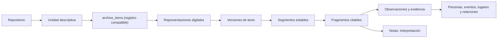
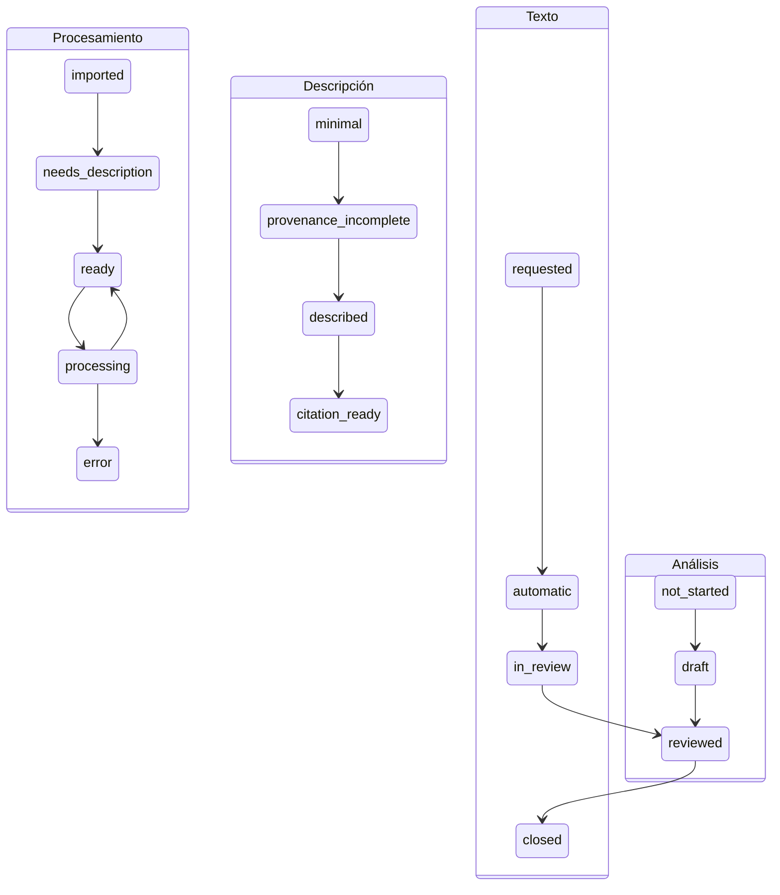

# Contrato de dominio de Fuentes primarias

Este documento acompaña los contratos ejecutables de
`shared/archiveTypes.ts` y `shared/primarySourcesTypes.ts`.

## Capas

La flecha indica recuperación y contexto, no propiedad exclusiva. Una unidad puede no
tener archivo; un registro puede tener muchos archivos; un fragmento puede localizar
una región o tiempo aunque no exista texto.

## Estados ortogonales

Acceso, sensibilidad, procesamiento, descripción, texto, análisis y preparación de
cita son dimensiones distintas. “Restringida” no implica “sin revisar”; “OCR
revisado” no implica “lista para citar”.

## Casos de migración

Los fixtures cubren vault vacío, imágenes, PDF con texto, enlaces genealógicos,
BLOB grande, archivo ausente, hash nulo, JSON desconocido, caracteres no latinos y
versión anterior. Cada migración compara conteos, IDs, bytes, hashes, texto, carpetas,
etiquetas, personas y metadatos desconocidos, prueba rollback, reapertura y copia
previa.

## Criterios de no pérdida

1. No se elimina ninguna columna heredada en la migración aditiva.
2. El BLOB nuevo coincide byte a byte con el heredado y su hash se verifica.
3. El texto extraído se conserva como versión `legacy`.
4. Carpetas, etiquetas, enlaces de persona e IDs permanecen estables.
5. JSON desconocido se copia sin normalización destructiva.
6. Un fallo revierte la transacción y deja abrible el esquema anterior.
7. Backup, sincronización, restauración y borrado inventarían sus tablas desde un
   inventario probado contra el esquema real.
