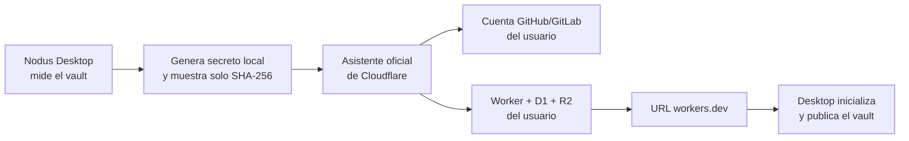

# Arquitectura de Nodus en Cloudflare

Revisado con la documentación oficial de Cloudflare el 14 de agosto de 2026. Precios, cuotas y límites se vuelven a comprobar antes de cada release y nunca se presentan como permanentes.

## Decisión

La arquitectura base es:

- **Cloudflare Workers** para HTTP, API v3, administración web, OAuth de MCP, autorización y mantenimiento.
- **D1** para cuentas de la instalación, espacios, dispositivos, sesiones, publicaciones, datos estructurados, FTS5 y el ledger de mutaciones.
- **R2 privado** para snapshots portables, imágenes, paquetes de biblioteca, matrices vectoriales exactas y objetos grandes.
- **Vectorize opcional** como índice derivado cuando el propietario añade un binding para la dimensión de su modelo. No es necesario para desplegar ni para recuperar los datos.

No se necesitan Pages, KV, Queues, Durable Objects, Containers ni Workers AI para reproducir las capacidades actuales. Los recursos estáticos mínimos los sirve el Worker. Los embeddings se generan en el dispositivo, por lo que no se entrega ninguna clave de un proveedor de IA al servidor.

La combinación Workers + D1 + R2 sigue siendo la opción más pequeña y mantenible para una instalación aislada por usuario: los bindings evitan credenciales S3 o de base de datos, R2 conserva archivos privados y D1 cubre SQL/FTS/transacciones. Vectorize no se incluye en la plantilla estática porque su dimensión depende del vault; la alternativa R2 exacta conserva portabilidad y despliegue sin pasos avanzados.

Referencias: [Workers](https://developers.cloudflare.com/workers/), [D1](https://developers.cloudflare.com/d1/), [R2](https://developers.cloudflare.com/r2/), [Vectorize](https://developers.cloudflare.com/vectorize/).

## Flujo directo “Deploy to Cloudflare”

1. Desktop inventaría el vault y estima coste para uso reducido, esperado e intensivo.
2. Desktop genera un secreto aleatorio de 256 bits, lo guarda cifrado por vault y muestra solo su verificador SHA-256.
3. Abre `deploy.workers.cloudflare.com` con la URL de esta plantilla pública. Esa URL no incluye datos del vault ni secretos.
4. El usuario inicia sesión directamente en Cloudflare y GitHub/GitLab. Cloudflare crea la copia del código, D1, R2 y el Worker en sus propias cuentas y solicita el verificador como secreto.
5. El script de despliegue aplica las migraciones D1 y publica el Worker en `workers.dev`; no hace falta un dominio.
6. El usuario pega esa URL en Desktop. Nodus valida servicio, versión, licencia y protocolo.
7. Desktop presenta el secreto original una sola vez al endpoint de bootstrap, crea el administrador y el espacio, recibe un token limitado al vault y publica la primera generación.
8. El Worker solo conserva el hash del secreto en Cloudflare. D1 bloquea nuevos bootstrap tras el primero. Desktop elimina su copia temporal y guarda cifrados el token del dispositivo y la clave de recuperación.

Nodus nunca recibe tokens de API, OAuth, cookies de sesión, identidad de cuenta ni datos de facturación de Cloudflare. Tampoco aloja un callback, un proxy ni un servicio de aprovisionamiento. El proceso oficial está documentado en [Deploy to Cloudflare](https://developers.cloudflare.com/workers/platform/deploy-buttons/).

### Límites inevitables del flujo oficial

- Cloudflare necesita una cuenta GitHub o GitLab para crear la copia actualizable de la plantilla.
- El botón oficial documenta aprovisionamiento automático de bindings, pero no una elección de jurisdicción D1/R2. La instalación sencilla usa ubicación automática. Fijación estricta requiere configuración avanzada manual según las opciones vigentes.
- La plantilla no puede saber las dimensiones de embeddings del vault. Usa R2 exacto. Un binding opcional `VECTORS_<dim>` activa Vectorize automáticamente para esa dimensión.

## Publicación y persistencia

El protocolo 3 separa datos estructurados y objetos:

- manifest con recuentos, hashes y capacidades;
- filas escalares en lotes acotados para respetar los límites de consultas D1 por invocación;
- FTS5 por generación;
- negociación de hashes para evitar cargas repetidas;
- multipart R2 con partes contiguas, hash por parte, tamaño declarado y aborto/reanudación;
- SHA-256 incremental del objeto ensamblado, sin cargarlo completo en memoria;
- matrices vectoriales exactas direccionadas por contenido, o namespaces Vectorize si hay un binding compatible;
- commit solo si filas, snapshot, assets, biblioteca y vectores coinciden con el manifest;
- cambio atómico de `active_generation`.

El mantenimiento diario conserva tres generaciones recuperables. Borra de D1 las anteriores y elimina de R2 solo objetos que ya no están referenciados. Vectorize es un índice derivado; los snapshots y matrices R2 son la copia portable.

Las mutaciones de Mobile tienen lista blanca de tablas/columnas, restricciones, identificador idempotente, cursor ordenado y confirmación. Un lote que referencia un archivo ausente se rechaza completo antes de persistir la primera mutación.

## Compatibilidad

El Worker conserva `/api/v1` para conectores clásicos y expone `/api/v3` para publicación, sincronización y recuperación explícitas. Incluye colecciones académicas, genealogía, estudio, docencia, bases personalizadas, testimonios, worldbuilding, notas, debates, Deep Research, biblioteca, Nodi, búsqueda literal/semántica, contexto, snapshots, mutaciones y MCP.

Desktop guarda `nodusServerKind` por vault y elige publicador clásico o Cloudflare. Los registros sin valor se interpretan como `classic`. Mobile consume el mismo contrato de `shared/cloudflare.ts` y `shared/cloudflareClient.ts`; véase [mobile-integration.md](mobile-integration.md).

## Límites operativos

El código pagina exportaciones, limita lotes y comprueba tamaños antes de leer contenido en memoria. La búsqueda vectorial exacta se limita a una matriz segura de 64 MiB por índice; si la supera, Nodus indica que se añada Vectorize o se desactive esa proyección. La búsqueda literal y los datos no se pierden.

Nodus no fuerza un plan. Cada cuenta conserva las cuotas que Cloudflare publique para Workers, D1 y R2. El estimador señala cualquier métrica que no quepa en el nivel gratuito del catálogo comprobado.

Referencias: [límites de Workers](https://developers.cloudflare.com/workers/platform/limits/), [límites de D1](https://developers.cloudflare.com/d1/platform/limits/), [límites de R2](https://developers.cloudflare.com/r2/platform/limits/), [límites de Vectorize](https://developers.cloudflare.com/vectorize/platform/limits/).
