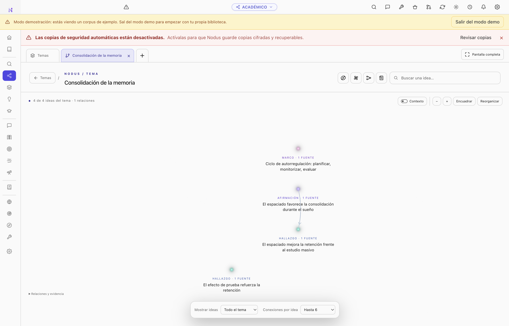
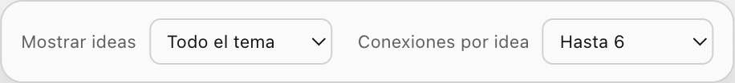
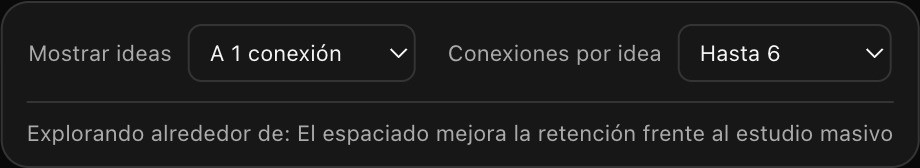

# Theme graph navigation

Click a theme in the graph's **Themes** tab to open its graph in a new tab named
after that theme. The Themes tab stays available. Switching tabs preserves each
graph, and **Back to themes** selects the overview without closing the theme tab.
Theme tabs can be closed individually.

New theme tabs default to **Show ideas: Entire theme** and **Connections per idea:
Up to 6**. The initial camera frames the entire theme.

- **Show ideas** selects the entire theme or ideas within one, two, or three
  connections of the focal idea. Selecting an idea changes the focus. Until an
  idea is selected, the most connected idea provides the starting point.
- **Connections per idea** offers All, Up to 3, Up to 6, Up to 10, and Custom.
  Custom accepts values from 1 to 1,000. All replaces the previous infinity button.
- Scope is calculated using the full theme graph before limiting the drawn
  connections. Reducing the connection limit preserves the selected set of ideas,
  including ideas with no currently drawn connection.
- Selected or previously revealed connections remain protected and can exceed
  the drawing limit. Otherwise, confirmed and explicit connections take priority,
  followed by confidence.

A limited scope displays **Exploring around: [idea]** below the controls. The
controls and hint are available in Spanish and all eleven translated locales.

## Screenshots

These captures use the Spanish interface and the isolated demonstration corpus.

## Verification

`node --test scripts/test-stellar-graph.mjs` covers graph scope and connection
limits. `npm run test:e2e:stellar-tabs` verifies the defaults, independent controls,
custom limits, named theme tabs, tab switching and closing, and produces the UI
captures under `output/stellar-tabs/` using an isolated demonstration profile.
