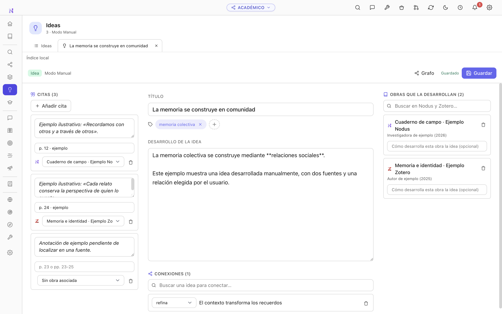
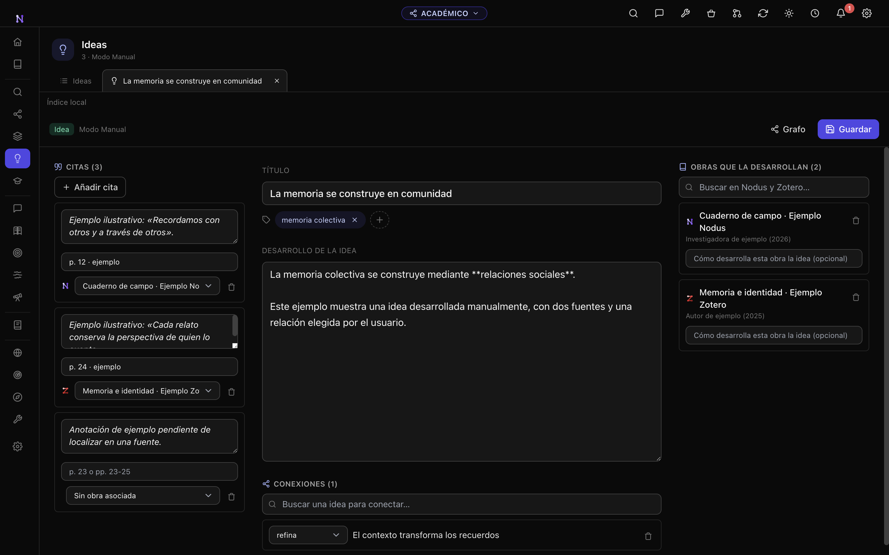
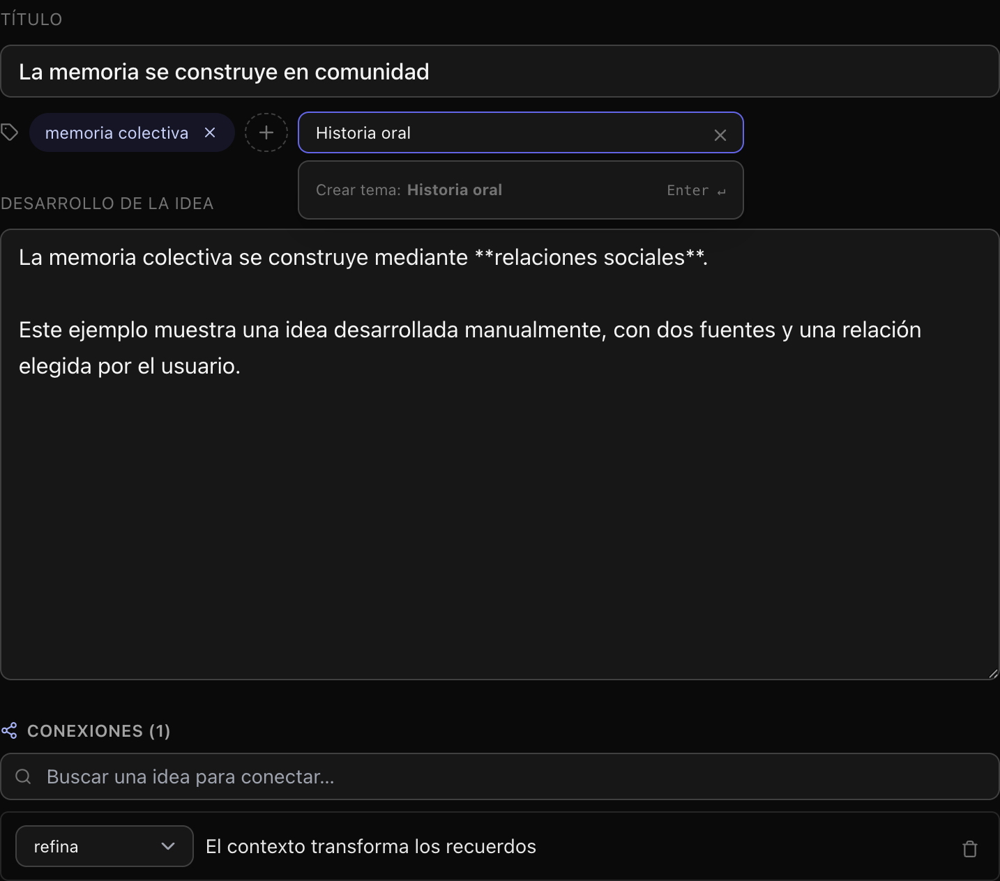
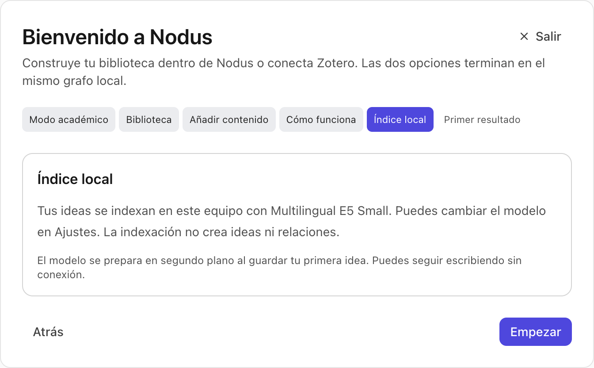
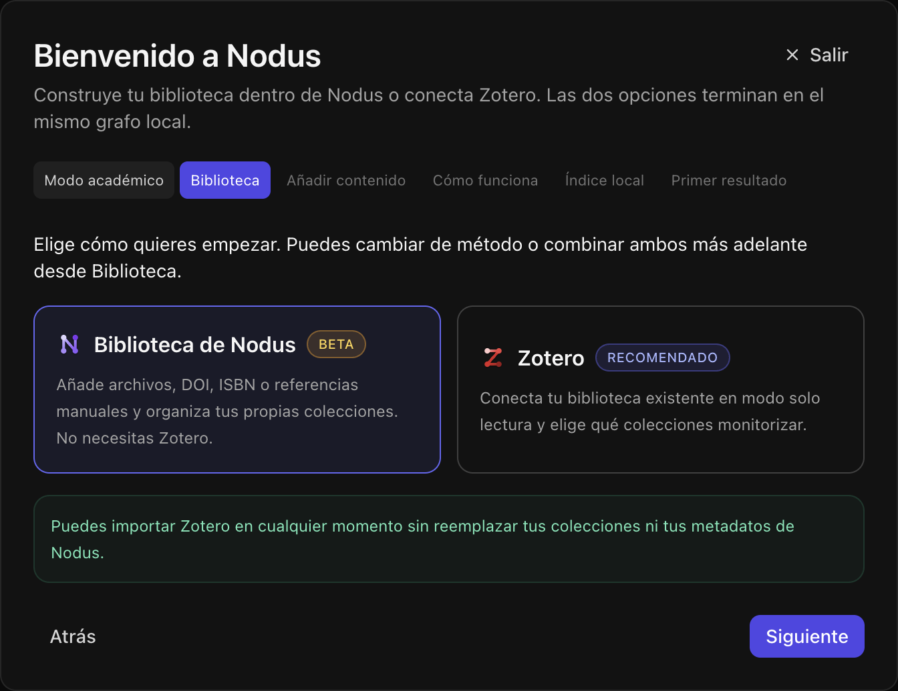

# Academic Manual mode: implementation and verification

Academic vault creation now starts with an explicit Auto / Manual choice. Existing vaults without a mode remain Auto. The mode is stored per vault, locked after onboarding, and preserved by duplication, backup and restore.

Manual ideas use a shared structured form in Ideas, Graph and Workspace: quotations on the left, title/themes/development/connections in the center, and works on the right. All associations are optional. The theme picker searches existing themes, creates only on Enter, and cancels with × or Escape. Nodus/Zotero provenance remains visible, including dual provenance. Wizard steps use content-sized, single-line labels with a consistent 28 px height and keep the active step visible when scrolling is needed.

## Data and AI behavior

- Saving the note and its graph representation is transactional. Directed connections keep their identity and direction when either endpoint is edited.
- Manual vaults use the existing local Multilingual E5 Small INT8 model by default. Index preparation and inference run after saving, with retries and guards against stale edits, deletion, model changes and vault changes. Embedding preferences remain vault-local.
- Import, synchronization, queues and direct corpus-generation services reject automatic knowledge creation in Manual mode. Linking a work does not copy analysis from another vault.
- Research Chat and Deep Research remain explicit user actions. Their context includes authored ideas and directed connections, including standalone ideas. Both graphs and Argument Map use the same corpus. Trashed manual ideas and their connections are excluded from the research consumers.
- No schema migration is added. Mode is stored in existing vault settings; explicit manual theme membership uses the existing idea-theme links. No private demo profile or credentials are committed.
- Initial local-model acquisition uses the existing download mechanism. Ordinary writing and indexing do not call generative providers. Explicit research tools and optional embedding-provider changes retain their existing configuration.

## Verification before PR integration

Dependencies were installed from the lockfile (`npm ci --no-audit --no-fund`), and better-sqlite3 was rebuilt for Electron. These local checks ran on macOS with Node 20.19.2 and Electron 43.4.0; CI uses Node 22.

| Check | Result |
| --- | --- |
| Production build, including renderer/main type checks | Passed after each UI refinement |
| `npm run test:ci` during initial implementation | 3,750 tests: 3,740 passed, 6 failed on startup/time limits, 2 cancelled, 2 skipped |
| Isolated replay of all affected model-picker/server suites | 29/29 passed, no failures or cancellations |
| Native Compass checks rerun under Electron ABI | 14/14 passed; resolves one initial skip |
| Library/Workspace regressions | 37/37 passed |
| Form/research/argument-map regressions | 54/54 passed |
| Existing onboarding checks | 28/28 passed |
| Manual service integration (`scripts/test-academic-manual.mjs`) | Passed with real SQLite, instrumented AI boundary, stale-write/retry/model/vault scenarios and research-consumer checks |
| General Electron smoke (`npm run test:e2e`) | Passed during initial implementation; no renderer errors |
| Manual Electron flow (`scripts/e2e-academic-manual.mjs`) | Passed after form refinement, including real E5 inference, standalone semantic search and restart |
| Wizard geometry and visual inspection | 17 checks passed: Auto/Manual, Nodus/Zotero, light/dark, back navigation, German and 150% zoom; no renderer errors |

The full suite was not rerun after each presentation-only refinement; the focused checks above cover those changes. The remaining local omission is the external marketplace icon fixture, which requires `NODUS_MARKETPLACE_DIR`. CI has a separate marketplace job. The complete suite result is therefore not reported as an unconditional pass.

Zotero E2E uses a local API fixture, including a recoverable HTTP 403. Failure/retry and alternate embedding-model scenarios use a controlled client; default E5 inference and search are also exercised for real. Research-context tests verify the data delivered to Chat/Deep Research without paid external generation calls. All screenshot materials and quotations are explicitly fictitious examples.

## Reproduction

```sh
npm ci
npx electron-builder install-app-deps
npm run lint
npm run build
node --test scripts/test-academic-manual.mjs
node --test scripts/test-vault-onboarding-ui.mjs scripts/test-onboarding-models.mjs
npm run test:ci
npm run test:e2e
node scripts/e2e-academic-manual.mjs
```

Do not rebuild while Electron tests are running, because Vite replaces the compiled assets. Use a new profile for each Manual E2E run; `NODUS_MANUAL_QA_PROFILE` selects its location and `NODUS_MANUAL_QA_EVIDENCE` selects its evidence directory.

## Screenshots






